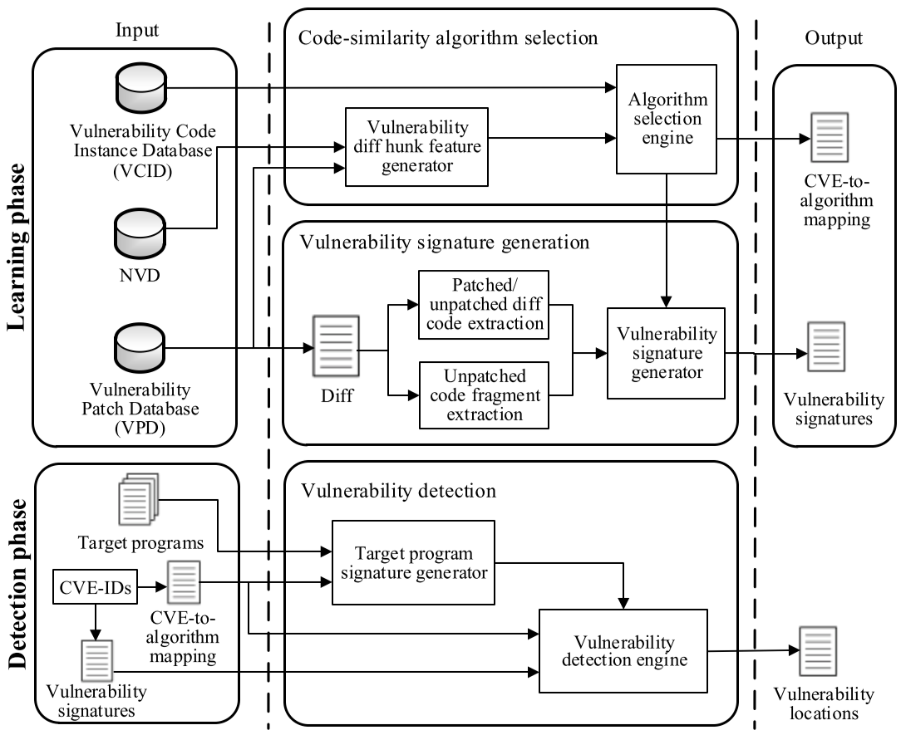
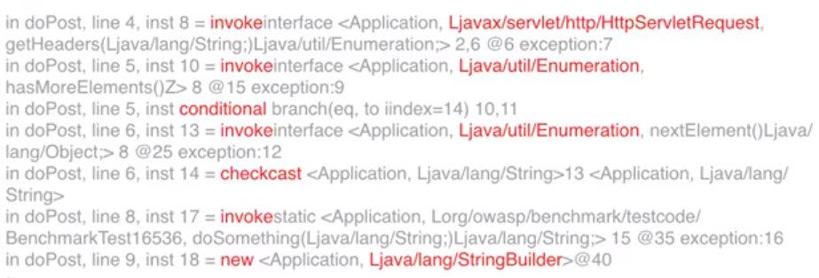
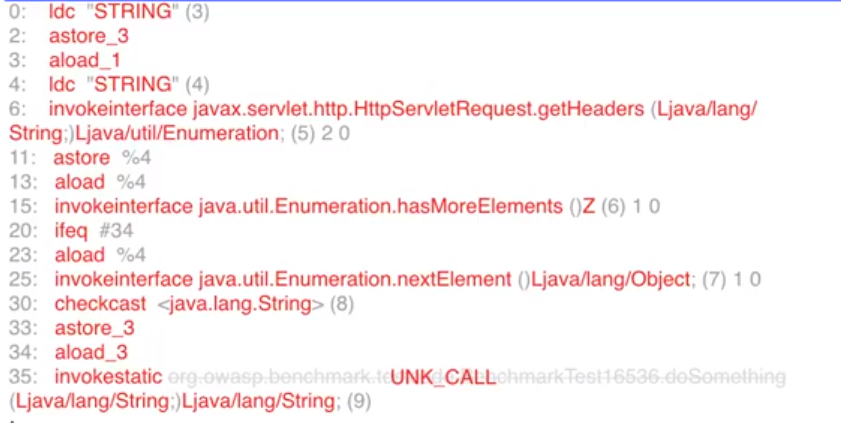
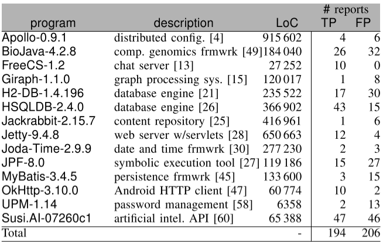
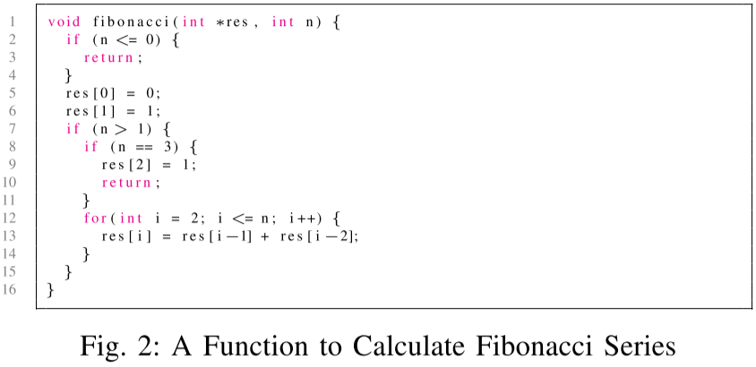

# 白盒漏洞挖掘

## [NDSS18]VulDeePecker: A Deep Learning-Based System for Vulnerability Detection.

使用BLSTM来检测C/C++中的安全漏洞。

介绍视频：<https://www.youtube.com/watch?v=YcIzDi15zN0>

个人翻译：https://github.com/Anemone95/MLDetectVuln/blob/master/VulDeePecker_translation.md

原文：https://arxiv.org/pdf/1801.01681.pdf>

### 背景

目前研究（手工规则）的缺点：

1. 需要手工定义特征
2. 存在FN（漏报）

### 第一步：生成代码片段（code gadget）

本文以code gadget为一个漏洞单位

以library/API为point，向前进行程序切片，获取相关的代码片段，接着组装

### 第二步：代码片段标记

### 第三步：将代码片段转化为向量

将变量和用户函数替换为Token，接着将所有Token映射为向量

### 第四步：训练BLSTM神经网络

标准训练步骤，选用BLSTM因为该网络考虑了上下文

### 第五步：检测

同样根据第一步到第三步将代码片段转化为向量，放入BLSTM，给结果

### 实验

#### 讨论数据集的问题

选择了NVD和SARD中的漏洞

https://github.com/CGCL-codes/VulDeePecker

对于标记误报标记：用扫描器扫描历史版本，除了已发现问题的其他均为误报

#### 试验结果

### 缺点

- 设计缺陷
  - 只能分析C/C++程序
  - 只能解决相关library/API方面的问题
  - 只能考虑data-flow不能考虑control-flow
- 实现缺陷
  - 受限于BLSTM
  - 代码未公开
- 评估缺陷
  - 只评估了缓冲区溢出和资源管理问题  

## [ACSAC2016]VulPecker: An Automated Vulnerability Detection System Based on Code Similarity Analysis

论文下载：http://www.cs.utsa.edu/~shxu/socs/VulPecker.pdf

VulDeePecker的前驱工作，定义一组描述补丁的特性以及代码相似度算法检测源代码片段是否存在漏洞。本文认为，一个能用在漏洞识别的相似性算法应该能够区别补丁前的代码和补丁后的代码。

本文贡献在于：

1. 本文建立了漏洞补丁数据集（VPD）和漏洞代码数据集（VCID）
2. 本文设计了一种相似度算法选择器，以针对不同的漏洞（尤其那些通过补丁推导出的漏洞）使用最优的相似度比较算法。

### 如何选择相似度算法

本文利用漏洞代码和补丁代码从候选算法中挑选，构造一个<CVE, Algorithm>的映射

### 0x02 构建漏洞代码特征

本文将相似度算法的属性总结为以下三种：

- code-fragment level：代码片段等级，即算法比较的粒度
  - patch-without-context：如diff后，标号为"-"的那一部分
  - slice：通过程序依赖图（Program Dependence Graphs, PDG）做程序切片得到的子图。
  - path-with-context：diff后，标号为“-”的那一部分加上没有变化的那部分
  - function：函数
  - file/component：文件或者是一个组件

- code representation：代码表示，每一种代码片段都可以表示为
  - text：文本，但是其包含很少的语法和语义信息，不适合做相似度比较
  - metric：将其用向量表示，以此来相互比较，经常用作file/component的比较（如TF-IDF）
  - token：将一行代码或是代码中的符号用编译方法转换为token
  - tree：用树组织变量，函数调用或者其他元素，以保存语法信息
  - graph：将一个函数表示成图，节点为表达式或赋值，边表示控制流
- comparison method：比较方法
  - vector comparsion：按向量方式比较
  - approximate/exact matching：完全匹配或者部分匹配

对于一个CVE，本文diff前后版本的代码，并获取以下特征，Type2-6是对于Patch的描述。

- Type1：基本特征，CVE-ID、CWE-ID、供应商、威胁等级等
- Type2：无实质性的特征，如：代码格式、空格变化、注释等
- Type3：组件特征，如：变量名和值，常量名和值、函数声明
- Type4：表达式特征，表达式的变化，如：赋值表达式、if条件、for/while条件
- Type5：声明特征，声明的变化，如：增加，删除，移动
- Type6：函数特征：函数的变化，如：全局变量定义和宏

### 0x03 准备输入

在学习阶段的输入有NVD，VPD，VCID

我们构建VPD，它包含了CVEID对应的diff文件，由于多个漏洞版本有多个漏洞代码，因此这些代码被放入VCID。

在检测阶段，输入有CVE-ID，目标代码，CVEtoAlgorithm的映射，以及漏洞签名。

### 0x04 关于相似度算法选择

候选相似度算法

选择标准即该算法能区分未patched的代码和已patched的代码，并且能够有最低的漏报率。

### 0x05 提取漏洞特征

先用diff提取数“-”开头的代码和未标记的代码，接着进行预处理——去除空格，格式化，和注释——接着将“-”开头的代码和未标记的代码转换成相似度算法需要的特征，Type2和Type6可以直接从diff中得到，Type3-Type5特征需要通过一些算法（如gumtree算法https://github.com/GumTreeDiff/gumtree）结合已打补丁的代码得到。

### 0x06 漏洞检测

给定一种漏洞，目标代码，算法映射和漏洞特征，相似度算法比较相似度判断目标代码是否存在漏洞

## [NDSS19]Neural Machine Translation Inspired Binary Code Similarity Comparison beyond Function Pairs.

将汇编语言文本看做自然语言，从而使用NLP对汇编语言文本进行处理，由NLP自动挖掘汇编语言中的内在联系，最终达到相似度比较的目的

## [MAPL2017]Learning a Classifier for False Positive Error Reports Emitted by Static Code Analysis Tools

本文总结了误报模式，并且考虑用方法体/程序切片技术和机器学习降低误报率（总感觉跟NDSS18的那篇文章方法很像）

演讲视频：<https://www.youtube.com/watch?v=hWiBU_Ht3lE>

### 误报模式

- 用户自己写的取消污点函数影响了污点传播

- 当污染字符和安全字符插入同一个Hashmap/ArrayList，而只使用安全字符拼接SQL时，污点传播受到欺骗

### 数据集

Owasp benchmark和Juliet

### 方法体/程序切片

方法体：直接将警告的方法字节码作为输入

切片：使用Tuning WALA进行程序前向切片（存在分析时间过长的问题，论文中介绍了解决问题的方法）

### 机器学习方法

朴素贝叶斯：对于朴素贝叶斯，我们只记录了操作码不记录操作数，但是调用的类会记录

LSTM：对于LSTM，我们用空格分开每一个Token，并且记录部分操作数，但是对于外部类将其替换为UNK_CALL

### 实验结果

使用前向切片的分类器可以获得更少噪声，因此预测更准确。

### 未来工作

- 使用众包扩大数据
- 用RNN分析AST
- 扩展为半监督式的在线服务

## [ICST19]An Empirical Assessment of Machine Learning Approaches for Triaging Reports of a Java Static Analysis Tool

本文展开实证研究，比较手工设计特征，词袋，RNN和GNN，使用真实程序集来测试他们的效果

源代码：https://bitbucket.org/ugur_koc/mangrove/src/master/

### 测试集构建

本文挑选了部分程序手工打标签

benchmark和现实程序产生的误报原因存在不同：
1）工具发现不可能实现的流
2）工具不能发现污染源实际上被消除
3）污染源实际上没有被污染

### 方法选择

- Hand-engineered Features 手工设计特征

  - Source
  - Sink
  - Source行号
  - Sink行号
  - 外部特征（如flash）
  - number of steps
  - 分析时间
  - 条件分支数量
  - 函数数量
  - 规则名称
  - 严重性

- 程序切片，使用[Joana](https://github.com/joana-team/joana)程序切片工具，基于[WALA](http://wala.sourceforge.net/)，自上而下切片（backward slip）

- Bag of Words，比较单词集合（不计顺序）的相似性，本文使用两种方式：

  - 出现频率（BoW-Freq）
  - 是否出现（BoW-Occ）

- RNN：

  - 数据清理：删除一些节点（不属于程序）

  - 抽象文字和字符串，例如两位数字用N2，三位数字用N3，更多位数字用N+,接着提取字符串列表并进行编号化，如STR1，STR2等

  - 许多程序员使用一组通用的短变量作为标识符如i,j,counter等，它对我们分析有意义，而其他变量名对程序分析无意义

    因此通过短语UNK标记一些无意义单词

  - 将camelCase和snake_case标识符拆分为组成单词  

- GNN

  - RNN不能表示程序的图结构，因此引入GNN

  - 我们使用了GNN的变体GGNN，引入三种初始化输入节点表示：

    1）种类、操作和类型字段（参照图一）

### 实验结果

#### RQ1总体结果

LSTM系的效果最好，紧接着是BoW和GGNN

#### RQ2数据预处理的作用

见红字，抽象化变量对新项目有效果

#### RQ4进一步分析

不同的算法的检测能力不重叠

### 威胁

- OWASP基准不能代表真实程序
- 我们扩充的14个程序的数据量不足以支持神经网络

### 未来工作

做一个投票机制，融合各个分析算法

## [ICSE19]LEOPARD: Identifying Vulnerable Code for Vulnerability Assessment through Program Metrics 

先做按复杂度对函数分类，再按漏洞指标进行函数排名，产生最危险的几个函数，提醒测试人员要重点测试

### 函数分类

不同的漏洞通常具有不同的复杂程度。为了识别各种复杂程度的漏洞，在第一步中，我们将目标应用程序中的所有函数按复杂度指标分类。结果，每个集合代表不同的复杂程度。之后，第二步（II-C节）通过排名进行预测。这种分类和排序方法旨在避免遗漏低复杂性却易受攻击的函数。

**复杂度指标。**通过“复杂性”，我们引用函数中的近似路径数，并从结构复杂度中导出函数的复杂度度量。函数通常具有循环和控制结构，这是结构复杂性的主要来源。 Cyclomatic复杂度是一种广泛使用的衡量复杂性的指标，但没有反映环路结构。基于这样的理解，我们引入了关于这两个互补维度的函数的复杂性，如表I所示。

**函数度量（C1）**反应函数的标准圈复杂度，即线性相关路径的数量。C1的较高意味着该函数可能更难以分析或测试。

**循环结构度量（C2-C4）**反映了循环产生的复杂性，这可以大大增加函数中的路径数量。度量标准包括循环数，嵌套循环数和循环的最大嵌套级别。循环在程序分析[68]中具有挑战性，并阻碍了漏洞分析。基本上，这些指标越高，需要考虑的路径就越多（也可能更长），分析功能就越困难。

**分类策略。**给定目标应用程序中函数的这些复杂性度量的值，我们通过将所有复杂性度量值相加来计算每个函数的复杂度分数，然后将具有相同分数的函数分组到同一个集合中。这里我们不使用基于范围的分箱策略（即，将分数落入相同范围的函数分组到相同的分箱中），因为难以确定该范围的合适粒度。这种简单的策略不仅使我们的框架轻量化，而且效果也很好，正如我们在IV-C节中实验研究所证明的那样。

### 函数排名

与结构复杂性度量不同，在第二步中，我们根据漏洞的一般原因的特征推导出一组新的漏洞度量，然后对每个集合中的函数进行排名并将其识别为潜在易受攻击的基于漏洞指标。现有的基于度量的技术很少采用任何面向漏洞的度量标准，并且不区分复杂性度量标准和漏洞度量标准。在这里，我们提出并纳入漏洞度量标准，以便具有表征和识别易受攻击的功能的巨大潜力。

**漏洞指标。 **C/C++程序中最关键的漏洞类型直接或间接地由内存管理错误和对某些敏感变量（例如指针）的缺失检查引起。产生的漏洞包括但不限于内存错误，访问控制错误（例如，缺少对用户权限的检查）和信息泄漏。实际上，许多拒绝服务和代码执行漏洞的根本原因也可以追溯到这些原因。上述类型占所有漏洞的70％以上。因此，可以定义一组与主要漏洞类型兼容的漏洞度量标准。在这里，我们不针对任何特定类型的漏洞，例如，包括与除零操作密切相关的划分操作等指标，而对特定类型的指标在未来是值得研究的方向。对于高或低复杂度分数，我们关注的易受攻击的函数主要是复杂和紧凑的计算，它们与函数中的路径数无关。基于这些观察，我们引入了函数w.r.t的漏洞度量。其有三个维度，如表II所示。

**依赖性度量（V1-V2）**表示函数与其他函数的依赖关系，即函数的涉及函数所需变量的数量和函数形参数量。函数越依赖于其他功能，越难以跟踪交互。

**指针度量（V3-V5）**捕获指针的操作，即指针算术的数量，指针算术中使用的变量的数量，以及变量所涉及的指针算术的最大数量。成员访问操作（例如，ptr→m），定义操作（例如，*ptr），递增指针（例如，ptr ++）和递减指针（例如，ptr--）都是指针算术操作。可以通过简单计数从函数的抽象语法树（AST）获得指针运算的数量。这些操作与敏感的内存操作密切相关，这会增加内存管理错误的风险。

与此同时，我们计算在指针算术运算中使用了多少个唯一变量。涉及的变量越多，程序员做出正确决策的难度就越大。对于这些变量，我们还检查它们涉及多少指针算术运算并记录最大值。对同一指针的频繁操作使得更难跟踪其值并保证正确性。总之，这些指标越高，引发复杂内存管理问题的可能性就越大，例如取消引用null或越界指针的可能性就越大。

**控制结构度量（V6-V11）**挖掘由于高度耦合和依赖控制结构（例如_if_和_while_）的漏洞，即嵌套控制结构的数量，没有显式_else_语句的_if_结构数，以及控制结构中涉及的变量数等。我们用计算Fibonacci系列的例子（图2）解释了上述指标。有两对嵌套控制结构，第7行的_if_、第8行的_if_和第12行的_for_。显然，最大嵌套级别为2，其发生在第7行的_if_。控制依赖的控制结构最大值为3，包括第7行和第8行_if_，以及第12行_for_。数据依赖的控制结构最大数目为4，因为四个控制结构都与n有关。所有三个_if_语句都没有_else_分支。有两个变量，即_n_和_i_涉及控制结构的谓词。实际上，谓词中使用的变量越多，就越有可能在完整性检查中产生错误。指标越高，程序员越难以遵循，并且在漏洞挖掘期间更难以达到函数的更深层次。缺少检查的隐式分支是可疑的。

复杂性和漏洞度量之间通常存在比例关系，因为函数的（独立路径和循环）结构越复杂，变量，指针和耦合控制结构就越有可能出现漏洞。复杂度度量用于估计函数中的路径数量，这对于易受攻击的特征是合适的。重要的是，对于用作漏洞指标的控制结构，它们描述了属性的不同方面而不是复杂度指标。首先，控制结构是嵌套的还是依赖的，或者_if_是否跟随_else_，这与复杂度指标无关。其次，密集耦合的控制结构是脆弱性的良好证据。

### 思考

虽然这篇文章没有使用机器学习，但是其中引入的一系列指标可以作为机器学习的指标。

# 修复方案生成

## [NDSS19]Automating Patching of Vulnerable Open-Source Software Versions in Application Binaries.

自动化给程序打补丁

# 其他

## [NDSS18]Automated Website Fingerprinting through Deep Learning.

网络指纹识别

## [NDSS18]Kitsune: An Ensemble of Autoencoders for Online Network Intrusion Detection.

网络入侵检测

