# VulDeePecker：基于深度学习的系统漏洞检测

**摘要：** 软件漏洞的自动检测是一个重要的研究问题。然而，该问题的现有解决方案依赖于人工定义特征并且经常漏掉许多漏洞（即导致高的漏报率）。在本文中，我们开始研究使用基于深度学习的漏洞检测方法来减轻手动定义特征繁琐和主观的任务。因为深度学习是用来处理与漏洞检测问题截然不同的问题，所以我们需要一些指导原则来将深度学习应用于漏洞检测。特别是，我们需要找到适合深度学习的软件程序表示。为此，我们建议使用代码Gadgets来表示程序，然后将它们转换为向量，其中代码Gadgets是在语义上彼此相关的多个（不一定是连续的）代码行。这有利于基于深度学习的漏洞检测系统的设计和实现。我们将我们的工具称为Vulnerability Deep Pecker（VulDeePecker）。为了评估VulDeePecker，我们第一个提出了用于深度学习方法的漏洞数据集。实验结果表明，VulDeePecker可以比其他方法获得更少的漏报（以及合理的误报）。我们进一步将VulDeePecker应用于3个软件产品（即Xen，Seamonkey和Libav）并检测到4个漏洞，这些漏洞未在国家漏洞数据库中报告，但在发布这些产品的更高版本时被供应商“默默”修补；然而，其他漏洞检测系统几乎完全忽略了这些漏洞。

# 简介
许多网络攻击的根源都是软件存在漏洞。尽管开发者已经投入了大量精力进行安全编程，但软件漏洞仍然存在并将继续成为一个重大问题。2010年，CVE中登记的漏洞数量约为4,600，在2016年增长到约6,500。有一种解决方法是自动检测软件程序中的漏洞。为此目的已经有许多静态漏洞检测系统的研究，从开源工具到商业工具，再到学术研究项目。然而，用于检测漏洞的现有解决方案具有两个主要缺点：大量手工操作和产生高漏报率，这将在下面详述。

一方面，现有的漏洞检测解决方案可以让专家定义特征。但即使对于专家来说，由于问题的复杂性，这是一项枯燥，主观且容易出错的任务。换句话说，特征的识别在很大程度上是一门艺术，这意味着所得到的特征的质量，以及由此产生的检测系统的有效性，会随着专家水平的变化而变化。原则上，通过要求多位专家定义特征，然后选择能够提高效率或使用这些特征组合的特征集，可以缓解这个问题。然而，这会带来更繁琐的工作。事实上，我们总是希望减少甚至消除工具效率对专家大量劳动的依赖。通过网络防御自动化的趋势可以看到，这是由DARPA的网络大挑战等倡议的。因此，重要的是要避免专家手动定义漏洞检测规则。

另一方面，现有的解决方案通常会漏掉许多漏洞导致高的漏报率。例如，两个最新的漏洞检测系统VUDDY 和VulPecker分别产生18.2％的误报率（当检测到Apache HTTPD v2.4.23的漏洞时）和38％（当应用于455个漏洞样本时）。我们自己的独立实验表明它们分别产生95.1％和89.8％的漏报率（参见第V节中的表格）。请注意，先前工作中报告的漏报率和我们实验得出的漏报率之间的巨大差异是由于使用不同的数据集引起的。高漏报率可能是因为工具强调低误报率——VUDDY分别为0％而VulPecker在文章中没有报告。我们的独立实验表明，他们的误报率分别为VUDDY的0％和VulPecker的1.9％（参见ⅡV部分的表V）。这表明VUDDY和VulPecker旨在实现低误报率，这似乎是检测代码克隆导致的漏洞的方法所固有的任务；相反，当使用这种方法来检测不是由代码克隆引起的漏洞时，就会出现高漏报率。

可以公平地说，具有高误报率的漏洞检测系统可能不可用，具有高假阴性率的漏洞检测系统可能无效。这证明了追求可以同时实现低漏报率和低误报率的漏洞检测系统的重要性。当这无法实现时（因为误报性和漏报性通常彼此不一致），只要误报性率不是太高，我们就可以强调降低漏报性率。

上述现有解决方案的两个局限性激发了设计新漏洞检测系统的重要性，不需要专家手动定义特征并且不会产生高的漏报率或误报率。在本文中，我们提出了以下漏洞检测的解决方案，同时牢记这些限制：给定目标程序的源代码，我们如何确定目标程序是否易受攻击？如果是，那么如何找到引起漏洞的代码？

**我们的贡献：**本文件最终解决上述问题的第一步。具体来说，我们做了三个贡献：

首先，我们开始使用深度学习进行漏洞检测。这种方法具有很大的潜力，因为深度学习不需要手动定义特征，这意味着可以自动进行漏洞检测。然而，这种方法具有挑战性，因为深度学习不是为这种应用而发明的，这意味着我们需要一些指导原则来将深度学习应用于漏洞检测。我们为此目的讨论了一些初步指导原则，包括软件程序的表示，以使深度学习适合于漏洞检测，确定应进行基于深度学习的漏洞检测的粒度，以及为脆弱性选择特定的神经网络检测。特别地，我们建议使用代码Gadgets来表示程序。代码Gadgets是在语义上彼此相关的许多（不一定是连续的）代码行，并且可以被矢量化作为深度学习的输入。

其次，我们介绍了一个基于深度学习的漏洞检测系统的设计和实现，称为漏洞深度挖掘器（VulDeePecker）。我们从以下角度评估VulDeePecker的有效性：

* VulDeePecker可以同时处理多种类型的漏洞吗？这种观点非常重要，因为有问题的目标程序可能包含多种类型的漏洞，这意味着只能检测一种漏洞的漏洞检测系统太有限了。实验结果肯定地回答了这个问题。这可以通过VulDeePecker使用漏洞模式（学习为深度神经网络）来检测漏洞这一事实来解释。
* 人工干预能帮助提高VulDeePecker的有效性吗？实验结果表明，通过结合人工干预可以进一步提高VulDeePecker的有效性。这暗示了自动漏洞检测系统虽然能够使专家免于定义功能的繁琐工作，但仍可能需要处于其他目的利用人们的专业知识。这为将来的研究提出了一个重要的未决问题。
* 与其他漏洞检测方法相比，VulDeePecker的效果如何？实验结果表明，VulDeePecker比其他静态分析工具（人工定义检测漏洞的规则）和最先进的基于代码相似性的漏洞检测系统（即VUDDY和VulPecker）更有效。

这些问题可被视为定义评估基于深度学习的漏洞检测系统有效性的基准的初步努力。

为了展示VulDeePecker的实用性，我们进一步将其应用于3种软件产品（即Xen，Seamonkey和Libav）。 VulDeePecker能够检测到4个漏洞，这些漏洞未在国家漏洞数据库（NVD）中报告，但在发布这些产品的更高版本时，供应商“默默地”修补了这些漏洞。相比之下，我们尝试过的其他漏洞检测系统几乎完全忽略了这些漏洞。更确切地说，其中一个漏洞检测系统能够检测到4个漏洞中的1个（即，4个漏洞中有3个漏洞），而其他系统错过了这4个漏洞。我们将进行更多实验，以显示VulDeePecker是否可以检测到尚未发现的漏洞，包括可能的0day漏洞。

第三，由于没有现成的数据集来回答上述问题，我们提出了第一个用于评估VulDeePecker和未来其他的基于深度学习的漏洞检测系统的数据集。该数据集源自美国国家标准与技术研究院（NIST）维护的两个数据源：NVD和软件保障参考数据集（SARD）项目。该数据集包含61,638个代码gadgets，包括易受攻击的17,725个代码gadgets和不易受攻击的43,413代码gadgets。在17,725个易受攻击的代码gadgets中，10,440个代码gadgets对应缓冲区错误漏洞（CWE-119），其余7,285个代码gadgets对应于资源管理错误漏洞（CWE-399）。我们数据上传到https://github.com/CGCL-codes/VulDeePecker。

本文的其余部分安排如下：第一部分介绍了基于深度学习的漏洞检测的一些初步指导原则。第二部分讨论了VulDeePecker的设计。第六部分描述了我们对VulDeePecker的实验评估和结果。第五节讨论了VulDeePecker的局限性以及未来研究的未解决问题。第六节描述了相关工作。第七节总结了本文。

# 基于深度学习的漏洞检测的原则

在本节中，我们提出了一些使用深度学习来检测漏洞的初步指导原则。这些原则对于本研究来说已足够，但可能需要进一步完善以满足基于深度学习的漏洞检测的更一般目的。这些原则集中在回答三个基本问题：（A）如何表示基于深度学习的漏洞检测程序？（B）基于深度学习的漏洞检测的粒度是什么？（C）如何选择特定的神经网络？

## A. 如何表示软件程序？

由于深度学习或神经网络将向量作为输入，我们需要将程序表示为对于漏洞检测具有语义意义的向量。换句话说，我们需要将程序编码为向量，这是深度学习所需的输入。请注意，我们不能随意将程序转换为向量，因为向量需要保留程序的语义信息。这表明我们使用一些中间表示作为程序与其矢量表示之间的“桥梁”，这是深度学习的实际输入。这导致：

_指导原则1：_程序可以首先转换为一些中间表示，保留（某些）程序元素之间的语义关系（例如，数据依赖性和控制依赖性）。然后，可以将中间表示转换为矢量表示，该矢量表示是神经网络的实际输入。

正如我们稍后将详细阐述的那样，指导原则1引导我们提出一个称为_代码gadgets_的中间表示。术语_代码gadgets_的灵感来自代码重用攻击中的_gadget_，因为_代码gadgets_是少量（不一定是连续的）代码行。

## B. 什么是合适的粒度？

由于不仅需要检测程序是否易受攻击，而且还要确定漏洞的位置，因此应该使用更精细的粒度来进行基于深度学习的漏洞检测。这意味着不应该在程序或函数级别进行漏洞检测，因为程序或函数可能包含多行代码而确定其漏洞的位置本身就是一项艰巨的任务。这导致：

_指导原则2：_为了方便确定漏洞的位置，程序应该被表示成一个比程序或函数更精细表示。

实际上，上述_代码gadget_表示导致了细粒度的漏洞检测粒度，因为_代码gadget_通常由少量代码行组成。这意味着_代码gadget_满足指导原则2。

## C.如何选择神经网络？

神经网络在图像处理，语音识别和自然语言处理等领域非常成功，这些领域与漏洞检测不同。这意味着许多神经网络可能不适合漏洞检测，我们需要一些原则来指导适合漏洞检测的神经网络的选择。我们的检查表明如下：

_指导原则3：_因为一行代码是否包含漏洞可能取决于上下文，可以处理上下文的神经网络可能适合于漏洞检测。

该原理表明，用于自然语言处理的神经网络可能适用于漏洞检测，因为上下文在自然语言处理中也很重要。将上下文的概念置于本文的设置中，我们观察到程序函数调用的参数经常受到程序中较早操作的影响，并且还可能受到程序中后续操作的影响。

由于有许多用于自然语言处理的神经网络，我们从递归神经网络（RNNs）开始。这些神经网络在处理顺序数据方面是有效的，并且实际上已经用于程序分析（但不用于漏洞检测目的）。然而，RNN存在梯度消失（VG）问题，这可能导致无效的模型训练。请注意，VG问题由RNN的双向变体继承，称为BRNN。而我们更喜欢不受VG问题影响的神经网络。

VG问题可以通过将记忆神经元转换为RNN来解决，包括长短期记忆网络（LSTM）单元和门控循环单元（GRU）单元。由于GRU在语言建模方面没有超越LSTM，我们选择LSTM进行漏洞检测，并在未来将其与GRU的比较。然而，LSTM可能不足以进行漏洞检测，因为它是单向的（即，从较早的LSTM细胞到较晚的LSTM细胞）。这是因为程序函数调用的参数可能会受到程序中早期语句的影响，并且可能也受到后面语句的影响。这表明单向LSTM可能不足，我们应该使用双向LSTM（BLSTM）进行漏洞检测。

图1展示了BLSTM神经网络的结构，它具有许多BLSTM层，一个稠密层（dense）和一个softmax层。学习过程的输入是某种向量表示。 BLSTM层有两个方向，即前向和后向。 BLSTM层包含一些复杂的LSTM单元，在本文中将其视为黑盒。稠密层减少了从BLSTM层接收的向量的维数。 softmax层将从密集层接收的低维向量作为输入，并负责表示和格式化分类结果，该分类结果提供用于在学习阶段更新神经网络参数的反馈。学习阶段的输出是具有精细模型参数的BLSTM神经网络，检测阶段的输出是分类结果。

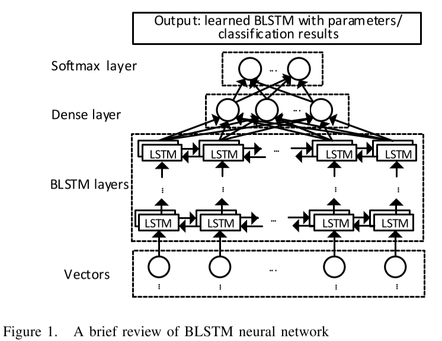

# VULDEEPECKER的设计

我们的目标是设计一个漏洞检测系统，该系统可以自动判断源代码是否易受攻击，如果是，则可以自动判断漏洞的位置。这应该在不要求手动定义特征并且不会产生高漏报率的情况下实现（只要误报率是合理的）。在本节中，我们将介绍VulDeePecker的设计。我们首先讨论_代码gadget_的概念，因为它对程序的表示至关重要。然后，我们概述VulDeePecker并详细说明它的组件。

## A. 定义代码片段

为了在适合神经网络输入的向量中表示程序，我们首先提出将程序转换为_代码gadget_的表示，其定义如下：

_定义1：(代码gadget）_代码gadget由许多程序语句（即代码行）组成，它们在数据依赖性或控制依赖性方面彼此相关。

为了生成_代码gadget_，我们提出了关键点的启发式概念，可以将其视为一个“镜头”，通过它我们可以从某个角度表示程序。直观地，关键点的启发式概念在某种意义上可以被视为漏洞的“中心”或暗示存在漏洞的代码段。对于由于不正确使用库/API函数调用而导致的漏洞，关键点是库/API函数调用；对于由不正确使用数组引起的漏洞，关键点是数组。值得注意的是，一类漏洞可能有多种关键点。例如，缓冲区错误漏洞可能对应于以下关键点：库/API函数调用，数组和指针。此外，多种类型的漏洞中可能存在相同类型的关键点。例如，缓冲区错误和资源管理错误漏洞都可能包含库/ API函数调用的关键点。准确定义关键点的启发式概念超出了本文的范围，并留作未来研究的一个有趣问题;相反，我们专注于使用这种启发式概念作为“镜头”，使用深度学习来学习漏洞模式。

在本文中，我们专注于使用库/API函数调用的特定关键点来证明其在基于深度学习的漏洞检测中的有用性。这是因为我们观察到许多漏洞与库/API函数调用有关。调查其他类型关键点的有用性也是一项有趣的未来工作。

对应于库/API函数调用的关键点，_代码gadget_可以通过数据流或程序的控制流分析生成，其中有众所周知的算法和易于使用的商业产品，如作为Checkmarx。值得一提的是，Checkmarx还可以根据专家手动定义的一些规则来检测漏洞。但是，我们不使用其漏洞检测规则；相反，我们将比较VulDeePecker与它的有效性。

## B. VulDeePecker概述

如图2所示，VulDeePecker有两个阶段：学习（即训练）阶段和检测阶段。学习阶段的投入是大量的训练程序，其中一些是脆弱的，而另一些则不是。 “易受攻击”是指程序包含一个或多个已知漏洞。学习阶段的输出是漏洞模式，其被编码到BLSTM神经网络中。

1）学习阶段：如图2（a）所示，学习阶段有4个步骤。

**步骤I：提取库/API函数调用和相应的程序片。**它有如下两个子步骤，在第III-C节中将详细说明。

* 步骤I.1：从训练程序中提取库/API函数调用，同时注意到当前版本的VulDeePecker关注与库/API函数调用关键点相关的漏洞。
* 步骤I.2：为在步骤I.1中提取的库/API函数调用的每个参数（或变量）提取一个或多个程序片。在本文中，程序片表示程序（即代码行）的语句，这些语句在语义上与库/API函数调用的参数相关，同时注意到最初引入了程序片的概念来表示语句关于程序点或变量的程序。

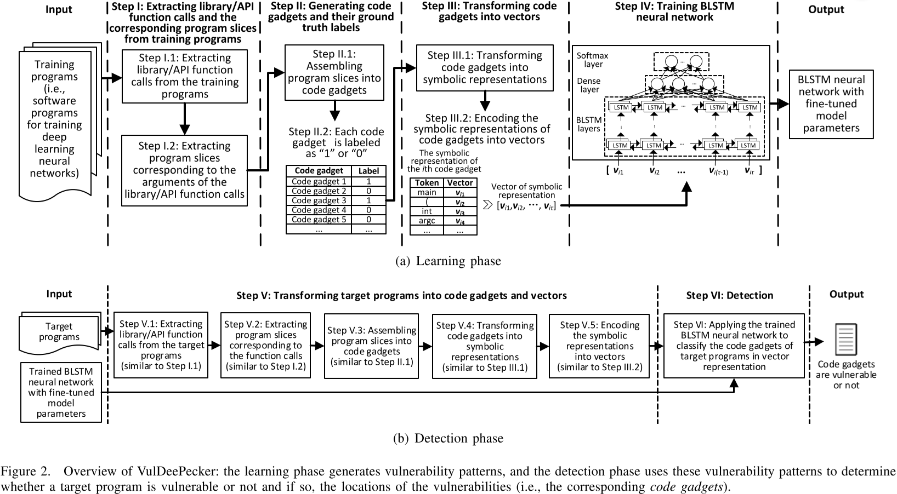

**步骤II：生成训练程序的代码gadgets及其事实标签。**该步骤有如下两个子步骤，并在第III-D节中详细说明。

* 步骤II.1：将步骤I.2中获得的程序切片组装成代码gadgets，每个库/API函数调用对应一个代码gadgets。代码gadgets不一定对应于某些连续的代码行。相反，它由多行代码组成，这些代码在语义上彼此相关（即，继承在那些程序片中编码的语义关系）。

* 步骤II.2：标记代码小工具的事实标签。该步骤将每个代码gadgets标记为“1”（即易受攻击的）或“0”（即，不易受攻击）。代码小工具的基本事实标签是可用的，因为我们知道训练程序是否易受攻击，如果它是易受攻击的，我们也知道漏洞的位置。

**步骤III：将代码gadgets转换为向量表示。** 此步骤有如下两个子步骤，并在III-E部分中详细说明。

* 步骤III.1：将代码gadgets转换为某些符号表示，稍后将对其进行详细说明。此步骤旨在保留训练程序的一些语义信息。
* 步骤III.2：将步骤II.1中获得的符号代表中的代码gadgets编码为向量，这是用于训练BLSTM神经网络的输入。这对于一般使用神经网络是必要的。

**步骤IV：训练BLSTM神经网络。**将代码gadgets编码为向量并获得其事实标签后，用于学习BLSTM神经网络的训练过程是标准的。

2）检测阶段：给定一个或多个目标程序，我们从它们中提取库/API函数调用以及相应的程序片，它们被组合成代码gadgets。代码gadgets被转换为它们的符号表示，其被编码成向量并用作训练的BLSTM神经网络的输入。
网络输出向量，以及对应的代码gadgets易受攻击（“1”）或不是（“0”）。如果代码gadgets容易受到攻击，则会在目标程序中确定漏洞的位置。如图2（b）所示，该阶段有两个步骤。

**步骤V：将目标程序转换为代码小工具和向量。**它有五个子步骤。

* 步骤V.1：从目标程序中提取库/API函数调用（类似于步骤I.1）。
* 步骤V.2：根据库/API函数调用的参数提取程序片（类似于步骤I.2）。
* 步骤V.3：将程序切片组装成代码小工具（类似于步骤II.1）。
* 步骤V.4：将代码小工具转换为其符号表示（类似于步骤III.1）。
* 步骤V.5：将代码小工具的符号表示编码到向量中（类似于步骤III.2）。

**步骤VI：检测。**该步骤使用学习好的BLSTM神经网络对与从目标程序中提取的代码gadgets相对应的向量进行分类。当向量被分类为“1”（即易受攻击的）时，意味着相应的代码gadgets易受攻击并且漏洞的位置被固定下来。否则，相应的代码gadgets被分类为“0”（即不易受攻击）。

步骤I-III分别在以下小节中详细说明。步骤IV和VI是标准步骤，步骤V类似于步骤I-II中的一些步骤。

## C. 步骤I：提取库/API函数调用和程序切片

_1）步骤I.1：提取库/API函数调用：_我们将库/API函数调用分为两类：前向库/API函数调用和后向库/API函数调用。前向库/API函数调用是直接从外部输入接收一个或多个输入的函数调用，例如命令行，程序，套接字或文件。例如，recv函数调用是一个前向库/API函数调用，因为它直接从套接字接收数据。后向库/API函数调用是函数调用，它们不直接从程序运行的环境接收任何外部输入。

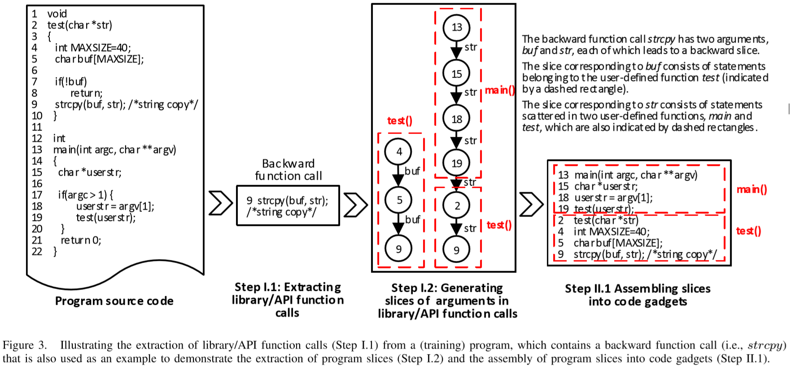

图3显示了后向库/API函数调用strcpy的示例（第9行）。它是一个后向库/ API函数调用，因为它不直接接收任何外部输入。

我们强调前向和后向库/API函数调用之间的区别。对于前向库/API函数调用，受输入参数影响的语句是关键的，因为它们可能容易受到不正确（例如，精巧制作）的参数值的影响；对于后向库/API函数调用，影响参数值的语句是关键的，因为它们可能使库/API函数调用易受攻击。我们将利用此观察来指导代码gadgets的向量产生。

_2）步骤I.2：提取程序片：_该步骤生成对应于从训练程序中提取的库/API函数调用的自变量的程序片。我们定义了两种切片：前向切片和后向切片，其中前向切片对应于受所讨论的参数影响的语句，而后向切片对应于可以影响所讨论的参数的语句。我们利用商业产品Checkmarx，更具体地说是它的数据依赖图，来提取这两种切片。基本思路如下：

* 对于前向库/API函数调用中的每个参数，生成一个或多个前向切片，后者对应于与参数相关的片在库/API函数调用时或后有分支的情况。

* 对于后向库/API函数调用中的每个参数，生成一个或多个后向切片，后者对应于在参数库/API函数调用之前或之前合并与参数相关的多个切片的情况。

请注意，程序片由多个语句组成，这些语句可能属于多个用户定义的函数。也就是说，切片可以超出用户定义函数的边界。

图3显示了一个包含库函数调用strcpy的示例程序，它有两个参数buf和str。由于strcpy是一个后向函数调用，因此对于它的每个参数，我们将生成一个后向切片。对于参数buf，切片由三个语句组成，即程序的第4,5和9行，它们属于用户定义的函数test。对于参数str，切片由六个语句组成，即程序的第13,15,18,19,2和9行，其中前4个属于用户定义的函数main，最后2个属于用户定义的函数test。这两个切片是链（线性结构），因为Checkmarx使用链来表示切片，同时注意到切片也可以由树表示。由于线性结构只能表示一个单独的切片，因此库/API函数调用通常对应于多个切片。

## D. 步骤 ll：提取代码gadgets并标记

_1）步骤II.1：将程序切片组装成代码gadgets：_上一步生成的程序切片可以组装成代码gadgets，如下所示。

首先，给定一个库/API函数调用和相应的程序切片，我们根据语句的出现顺序将属于同一个函数的语句（即代码片段）组合成一个片段。如果任何语句重复，则删除重复。

在图3的示例中，属于用户定义的函数test的包含对应于参数buf程序切片的三个语句（即第4,5和9行）以及两个对应于参数str的语句（即第2行和第9行）。因此，我们需要将它们组装成单个部分，因为它们与相同的功能测试相关。根据这些声明在功能测试中出现的行号，这将导致2 → 4 → 5 → 9 → 9。由于对应于第9行的语句是重复的，因此我们消除了重复以导出一个组合语句2 → 4 → 5 → 9，它们对应于函数test。

其次，将属于不同的用户定义函数的语句组合到单个代码gadgets中。如果属于这些用户定义函数的两个语句之间已经存在顺序，则保留此顺序；否则，使用随机顺序。

在图3的示例中，当组装函数main的语句时（即行13,15,18和19）和函数test的语句（即，在第2,4,5和9行中，我们得到 13 → 15 → 18 → 19 → 2 → 4 → 5 → 9，它是对应于库函数调用strcpy的代码gadgets。此代码gadgets保留了与参数str对应的使用顺序。

_2）步骤II.2：标记：_每个代码gadgets需要标记为“1”（即易受攻击的）和“0”（即，不易受攻击）。如果代码gadgets对应于训练数据集中已知的漏洞，则标记为“1”；否则，标记为“0”。在第IV-C节中，我们将在处理与特定漏洞数据源相关的程序时详细讨论基础事实的标签。

## E. 步骤 III: 将代码gadgets转换为向量

_1）步骤III.1：将代码gadgets转换为向量表示：_该步骤旨在启发式地捕获用于训练神经网络的程序中的一些语义信息。首先，删除非ASCII字符和注释，因为它们与漏洞无关。其次，以一对一的方式将用户定义的变量映射到符号名称（例如，“VAR1”，“VAR2”），同时注意到多个变量可以在它们出现在不同的代码gadgets中时映射到相同的符号名称。第三，以一对一的方式将用户定义的函数映射到符号名称（例如，“FUN1”，“FUN2”），同时注意当多个函数出现在不同的代码gadgets中时可以映射到相同的符号名称。

图4突出显示上述过程。

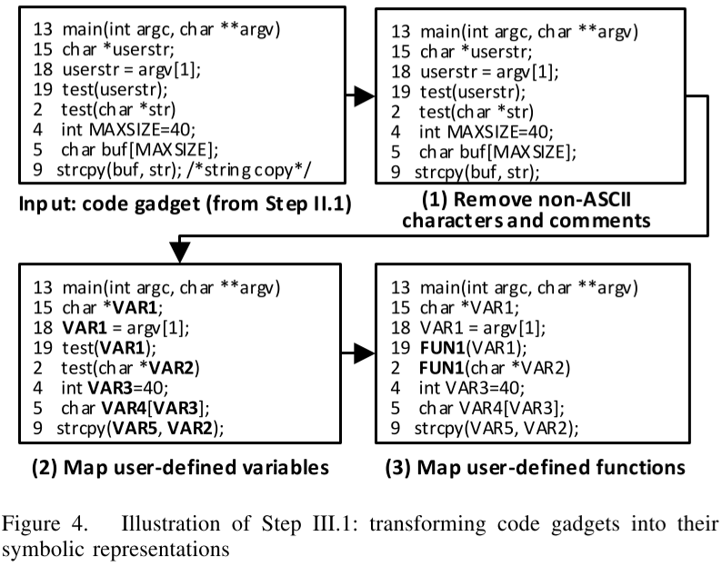

_2）步骤III.2：将符号表示编码到向量中：_每个代码小工具需要通过其符号表示编码到向量中。为此，我们通过词法分析将符号表示中的代码gadgets划分为一系列tokens，包括标识符，关键字，运算符和符号。例如，`strcpy(VAR5,VAR2)`可以被表示为7个tokens：`strcpy`、`(`、`VAR5`、`,`、`VAR2`、`)`、`；`，这导致了大量的tokens产生。为了将这些tokens转换为向量，我们使用word2vec工具，因为它被广泛用于文本挖掘而被选中。这个工具基于分布式表示的思想，它将一个标记映射到一个整数，然后将其转换为固定长度的向量[43]。

由于代码gadgets可能具有不同数量的tokens，因此相应的向量可以具有不同的长度。由于BLSTM采用等长向量作为输入，我们需要进行调整。为此，我们引入一个参数τ作为对应于代码gadgets向量的固定长度。

* 当向量比τ短时，有两种情况：如果代码gadgets是从后向切片生成的，或者是通过组合多个后向切片生成的，我们在向量的开头填充零；否则，我们将零填充到向量的末尾。
* 当向量长于τ时，还有两种情况：如果代码小工具是从一个后向切片生成的，或者是通过组合多个后向切片生成的，则删除向量的开始部分；否则，我们删除向量的结尾部分。

这确保了从后向切片生成的每个代码gadgets的最后一个语句是库/API函数调用，并且从前向切片生成的每个代码gadgets的第一个语句是库/API函数调用。结果，每个代码gadgets都表示为τ位向量。向量的长度与BLSTM每层隐藏节点的数量有关，这是一个可以调整的参数，以提高漏洞检测的准确性（参见第IV-C节）。

# 实验和结果

我们的实验集中在回答以下三个研究问题（RQ）：

* RQ1：VulDeePecker可以同时处理多种类型的漏洞吗？

  漏洞检测系统应该能够同时检测多种类型的漏洞，因为否则需要维护多个检测系统。为了回答这个问题，我们将进行涉及一种或多种类型漏洞的实验。

* RQ2：人们的专业知识（定义特征除外）能否提高VulDeePecker的有效性？

  为了回答这个问题，我们将研究比较人工选择的库/API函数调用与使用所有库/API函数调用的有效性。

* RQ3：与其他漏洞检测方法相比，VulDeePecker的有效性如何？
  
  为了回答这个问题，我们将VulDeePecker与其他方法进行比较，包括一些静态分析工具和基于代码相似性的漏洞检测系统。

## A. 用于评估漏洞检测系统的度量标准

我们使用广泛使用的度量误报率（FPR），漏报率（FNR），召回率（TPR），精确度（P）和F1-measure（F1）来评估漏洞检测系统。设TP是正确检测到漏洞的样本数，FP是检测到漏洞的样本数，FN是未检测到真漏洞的样本数，TN是未检测到漏洞的样本数。误报率指标FPR = FP/(FP+TN)。漏报率指标FNR = FN/(TP+FN)。漏洞检出率或召回度量TPR = TP/(TP+FN)，同时注意到TPR = 1-FNR。精度度量P = TP/(TP+FP)。F1=2·P·TPR/(P+TPR)。

理想的情况是，漏洞检测系统既不会漏掉漏洞（即FNR≈0和TPR≈1）也不会触发误报（即FPR≈0和P≈1），这意味着F1≈1。但是，这很难在实践中实现，并且经常迫使人们根据另一个指标的有效性来衡量有效性。在本研究中，我们倾向于实现低FNR和低FPR。

## B. 准备VulDeePecker的输入

**收集程序。** NIST维护了两种广泛使用的漏洞数据来源：NVD包含生产软件中的漏洞，SARD项目包含生产，综合和学术安全漏洞或漏洞。在NVD中，每个漏洞都有一个唯一的常见漏洞和暴露标识符（CVE ID）和一个通用弱点枚举标识符（CWE ID），用于指示相关漏洞的类型。我们收集包含一个或多个漏洞的程序。在SARD中，每个程序（即测试用例）对应一个或多个CWE ID，因为程序可能有多种类型的漏洞。因此，我们收集具有一个或多个CWE ID的程序。

在本文中，我们关注两种类型的漏洞：缓冲区错误（即CWE-119）和资源管理错误（即CWE-399），每种漏洞都有多种子类型。这些漏洞非常常见，这意味着我们可以收集足够的数据来使用深度学习。我们选择19种流行的C/ C++开源产品，包括Linux kernel，Firefox，Thunderbird，Seamonkey，Firefox_esr，Thunderbird_esr，Wireshark，FFmpeg，Apache Http Server，Xen，OpenSSL，Qemu，Libav，Asterisk，Cups，Freetype，Gnutls，Libvirt和VLC媒体播放器，根据NVD，这些软件包含这两种类型的漏洞。我们还收集了SARD中包含这两类漏洞的C/C ++程序。总之，我们收集了与缓冲区错误漏洞相关的NVD中520个开源软件程序和与资源管理错误漏洞相关的320个开源软件程序;我们还收集了与缓冲区错误漏洞相关的SARD 8,122程序（即测试用例）和与资源管理错误漏洞相关的1,729个程序。请注意，包含漏洞的程序实际上可能包含多个程序文件。

**训练程序与测试程序**。我们随机选择收集的80％的程序作为训练，其余20％作为测试。在处理一种或两种类型的漏洞时，这个比例同样适用。

## C.学习BLSTM神经网络

这对应于VulDeePecker的学习阶段。我们使用Theano和Keras在Python中实现BLSTM神经网络。我们在一台运行NVIDIA GeForce GTX 1080 GPU和Intel Xeon E5-1620 CPU的机器上运行实验，运行频率为3.50GHz。

**步骤I：提取库/API函数调用和相应的程序切片。**我们从程序中提取C/C++库/API函数调用。有6,045个C/C ++库/API函数调用涉及标准库函数调用、Windows API和Linux内核API函数调用。总的来说，我们从程序中提取了56,902个库/API函数调用，包括7,255个前向函数调用和49,647个后向函数调用。

为了回答以上问题，我们还手动选择了124个与缓冲区错误漏洞（CWE-119）相关的C/C ++库/API函数调用（包括带通配符的函数调用），以及16个C/C ++库/API函数调用相关资源管理错误漏洞（CWE-399）。选择这些功能调用是因为上述商业工具Checkmarx使用的规则声称它们与这两种类型的漏洞有关。相应地，我们从训练程序中提取40,351个库/API函数调用，包括4,012个前向函数调用和36,339个后向函数调用。对于库/ API函数调用的每个参数，提取一个或多个程序片。

**步骤II.1：生成代码小工具。**代码小工具是从程序切片生成的。我们获得了61,638个代码小工具的代码小工具数据库（CGD），其中48,744个代码小工具是从培训程序的程序片段生成的，12,894个代码小工具是从目标程序的程序片段生成的。生成小工具的时间复杂度主要取决于数据流分析工具。例如，从100个随机选择SARD的程序（99,232行）生成2,494个代码小工具需要883秒，这意味着每个代码小工具平均为354毫秒。为了回答上面提到的RQ，我们使用CGD来导出以下6个数据集。

* BE-ALL：与缓冲区错误漏洞（CWE-119）相关的所有库/API函数调用相对应的CGD子集（即，无人工情况下提取）。
* RM-ALL：与资源管理错误漏洞（CWE-399）相关的所有库/API函数调用相对应的CGD子集。
* HY-ALL：对应于混合（即两者）缓冲区错误漏洞（CWE-119）和资源管理错误漏洞（CWE-399）的所有库/API函数调用。也就是说，它与CGD相同。
* BE-SEL：CGD的子集，对应于缓冲区错误漏洞（CWE-119）中手动选择的函数调用（而不是所有函数调用）。
* RM-SEL：对应于资源管理错误漏洞（CWE-399）中手动选择的函数调用。
* HY-SEL：CGD的子集，对应于混合缓冲区错误漏洞（CWE-119）和资源管理错误漏洞（CWE-399）以及手动选择的函数调用。

表1总结了这些数据集中的代码gadgets数量。

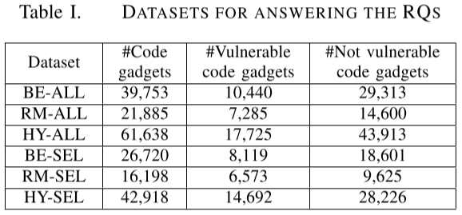

**步骤II.2：标记代码gadgets。**代码小工具标记如下。对于从NVD程序中提取的代码gadgets，我们关注其修补程序涉及行删除或修改的漏洞。这个过程有两个步骤。在第一步中，如果代码gadgets包含至少一个根据修补程序删除或修改的语句，则自动标记为“1”（即易受攻击），否则标记为“0”（即，不易受攻击） 。但是，这个自动过程可能会错误地将一些不易受攻击的代码gadgets标记为“1”。为了删除这些错误标签，第二步是手动检查标记为“1”的代码小工具，以便纠正错误标签（如果有的话）。

注意到SARD中的每个程序都已经标记为好（即没有安全缺陷），坏（即包含安全缺陷），或者与相应的CWEID混合（即包含具有安全缺陷及其修复方案）。对于从关于SARD的程序中提取的代码gadgets，从好程序中提取的代码gadgets被标记为“0”（即，不易受攻击），对于坏程序或混合程序中提取的代码gadgets，如果它包含至少一个易受攻击的声明则被标记为“1” ，否则为”0“。由于我们在SARD程序的标记过程中使用了启发式算法，我们查看了1000个随机代码gadgets的标签，发现其中只有6个（即0.6％）被错误标记。这些错误标记的样本是由于一段不易受攻击的代码中的语句与一段易受攻击的代码中的语句相同。由于错误标记的代码gadgets非常少并且神经网络对于一小部分错误标记的样本是健壮的，因此不必手动检查为SARD程序提取的代码gadgets的所有标签。

可能遇到一个代码gadgets同时用“1”和“0”标记的情况（即冲突标记）。造成这种现象的一个原因是数据流分析工具的不完善。在这种情况下，我们删除这些代码gadgets。结果，17,725个代码gadgets被标记为“1”，而43,413个代码gadgets被标记为“0”。在标记为“1”的17,725个代码gadgets中，10,440个代码gadgets对应于缓冲区错误漏洞，7,285个代码gadgets对应于资源管理错误漏洞。表I显示了易受攻击的代码gadgets的数量（第3列）以及每个数据集中不易受攻击的代码gadgets的数量（第4列）。

**步骤III：将代码gadgets转换为向量。**CGD包含总共6,166,401个tokens，其中23,464个tokens不同。将用户定义的变量名称和函数名称映射到某些符号名称后，不同标记的数量将进一步减少到10,480。这些符号表示被编码为矢量，其被用作训练BLSTM神经网络的输入。

**步骤IV：训练BLSTM神经网络。**对于表1中的每个数据集，我们采用10倍交叉验证训练和BLSTM神经网络，并选择与漏洞检测有效性相对应的最佳参数值。例如，我们改变每个BLSTM神经网络的隐藏层数，并观察对所得F1测量的影响。当我们调整隐藏层的数量时，我们将这些默认值设置为默认值，并将参数设置为深度学习社区广泛使用的值。代码小工具的向量表示中的标记数设置为50，丢失设置为0.5，批量大小设置为64，历元数设置为4，小批量随机梯度下降与ADAMAX一起[29]用于默认学习率为1.0的训练，并选择300个隐藏节点。

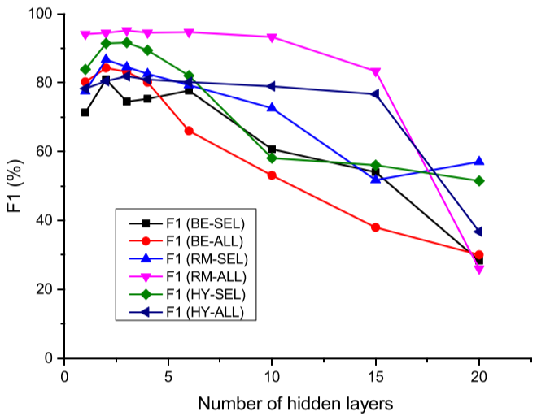

图5描绘了VulDeePecker相对于具有不同隐藏层数的6个数据集的F1度量j结果，不同数据集对应不同的神经网络。我们观察到6个BLSTM神经网络的F1测量在2或3层达到最大值，并且当层数大于6时，大多数BLSTM神经网络的F1测量值下降。注意其他参数BLSTM神经网络可以以类似的方式进行调整。

## D.实验结果和影响

1）回答RQ1的实验：为了测试VulDeePecker是否可以应用于多种类型的漏洞，我们在三个数据集上进行实验：BE-ALL，RM-ALL和HY-ALL。分别训练三个神经网络，其有效性在表II中报告。

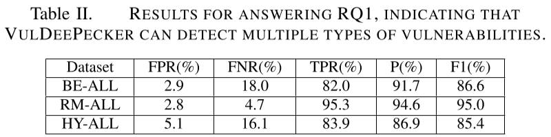

我们观察到，根据所有五个指标，由RM-ALL数据集训练的神经网络优于由BE-ALL数据集训练的神经网络。这可以通过以下事实来解释：与资源管理错误漏洞相关的库/API函数调用的数量远远小于与缓冲区错误漏洞相关的库/ API函数调用的数量。我们还观察到，就FPR和P指标而言，从HY-ALL数据集训练的神经网络不如从BE-ALL或RM-ALL数据集训练的神经网络。我们进一步观察到，从HY-ALL数据集训练的神经网络的TPR和FNR位于从RM-ALL数据集训练的神经网络和从BE-ALL数据集训练的神经网络之间。从HY-ALL数据集训练的神经网络的F1测量值比从BE-ALL数据集训练的神经网络低1.2％，比从RM-ALL数据集训练的神经网络低9.6％。这可以通过以下事实来解释：混合数据集的漏洞相关的库/API函数调用的数量大于与单个类型的漏洞相关的库/ API函数调用的数量。我们推测这是由以下原因引起的：从漏洞相关的大量库/API函数调用提取漏洞模型比从少量相关的库/API函数调用提取漏洞模式更困难。

表III总结了与HY-ALL数据集相对应的训练时间和检测时间，其中第二列表示用于训练的代码小工具的数量（即，从训练程序中提取），第三列表示用于检测的代码小工具的数量（即，从目标程序中提取）。我们观察到，深度学习技术所暗示的VulDeePecker的训练时间很长，但检测时间很短。

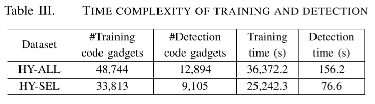

总之，我们通过以下方式肯定地回答RQ1：

_Insight 1：_VulDeePecker可以同时检测多种类型的漏洞，但有效性与漏洞相关的库/API函数调用数量有关（即越少越好） 。

2）回答RQ2的实验：为了回答是否可以通过结合人类专业知识来改进VulDeePecker，我们将使用自动提取的所有库/API函数调用与使用手工选择的一些库/API函数调用对比，这些手工选择的库由Checkmarx的专家指导。

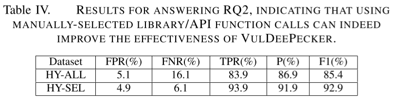

如表IV所示，从HY-SEL数据集训练的BLSTM网络比从HY-ALL数据集训练的BLSTM网络更有效。尽管FPR的改善很小（0.2％），但其他每个指标的改进都很大：FNR和TPR为10％，精度为5％，F1-measure为7.5％。此外，表III显示使用手动选择的库/API函数调用的训练时间可以小于使用所有库/API函数调用的训练时间，因为需要处理较少数量的代码gadgets。这说明初步了解专业知识在提高基于深度学习的漏洞检测的有效性方面的有用性：

_Insight 2：_专业知识可用于选择库/API函数调用，以提高VulDeePecker的有效性，尤其是整体有效性。

3）回答RQ3的实验：为了回答RQ3，我们比较了VulDeePecker与基于模式和基于代码相似性的漏洞检测系统的有效性。我们还比较了它们在检测缓冲区错误漏洞（即BE-SEL数据集）和资源管理错误漏洞（即RM-SEL数据集）中的有效性。

为了与使用人类专家定义的规则的其他基于模式的漏洞检测系统进行比较，我们考虑一种名为Checkmarx的商业产品和两种名为Flawfinder和RATS的开源工具。选择这些系统是因为我们可以访问它们，据我们所知，它们已被广泛使用。为了与基于代码相似性的漏洞检测系统（主要面向克隆引起的漏洞）进行比较，我们考虑了两个最先进的系统VUDDY和VulPecker。我们使用VUDDY的开放服务，并使用作者提供给我们的VulPecker的原始实现。为了公平比较，我们需要解决一些微妙的问题。我们观察到VulPecker使用diff作为输入，其中diff描述易受攻击的代码片段与其修补版本之间的差异，我们将目标程序的BE-SEL数据集分成两个子集，即BE-SEL-NVD（266个样本派生）来自NVD）和BE-SEL-SARD（来自SARD的其余样品）。我们使用BE-SEL-NVD进行比较研究，因为VUDDY和VulPecker旨在检测具有差异的CVE ID或漏洞的漏洞，但无法检测BE-SEL-SARD中的漏洞。

表V总结了实验结果。我们观察到如下结果：首先，VulDeePecker大大优于其他基于模式的漏洞检测系统，因为VulDeePecker的FPR为5.7％，FNR为7.0％，分别比其他检测系统的FPR小得多。通过查看其他系统，我们发现Flawfinder和RATS不使用数据流分析，因此错过了许多漏洞。尽管Checkmarx确实使用了数据流分析，但其识别漏洞的规则是由人工定义的，并且远非完美。这进一步强调了让人们免于繁琐任务的重要性（类似于手动定义功能的任务）。这一观察结果说明：

_Insight 3：_利用数据流分析，基于深度学习的漏洞检测系统可以更加有效。 （这暗示我们可以通过利用控制流分析来推测系统可以更有效。未来有效的工作可以验证或使这种推测无效。）

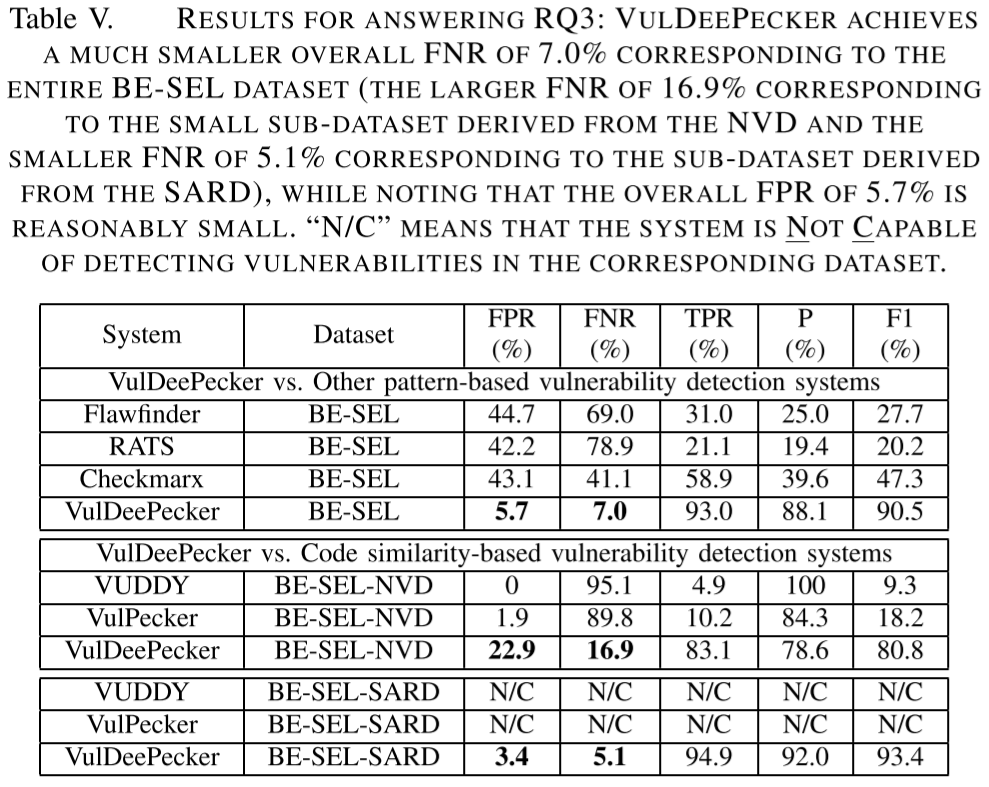

其次，对于BE-SEL-NVD子数据集，VUDDY和VulPecker为低FPR（分别为0％和1.9％）和高FNR（分别为95.1％和89.8％），这导致F1非常低（分别为9.3％和18.2％）。高FNR可以通过以下事实来解释：VUDDY只能检测与功能相关的漏洞，这些漏洞几乎与训练程序中的易受攻击的功能相同（即，由I型和II型代码克隆引起的漏洞）; VulPecker只能检测由类型I，类型II和某些类型III代码克隆（例如，删除，插入和重新排列语句）引起的漏洞，这解释了为什么VulPecker导致的FNR低于VUDDY。但是，这些系统无法检测到不是由代码克隆引起的漏洞，这就解释了为什么它们会导致高FNR。

相比之下，VulDeePecker的F1值要高得多，因为它具有更高的TPR（即FNR低得多）。我们怀疑对应于BE-SEL-NVD数据集高出的22.9％FPR是由于NVD的少量训练代码gadgets引起的。这可以通过3.4％的FPR来证明，该FPR对应于来自SARD的大量训练代码gadgets，其大约是来自NVD的训练代码gadgets的数量的18倍。

因此，可以说VulDeePecker基本上优于两个最先进的基于代码相似性的漏洞检测系统，因为VulDeePecker在整个数据集中产生了5.7％的FPR和7.0％的FNR。然而，值得注意的是，基于深度学习的漏洞检测在很大程度上依赖于数据量。这说明：

_Insight 4：_VulDeePecker比基于代码相似性的漏洞检测系统更有效，它不能检测不是由代码克隆引起的漏洞，因此通常会导致高的漏报率。然而，VulDeePecker的有效性对数据量很敏感，这似乎是深度学习的本质所固有的。

**在实践中使用VulDeePecker。**为了进一步展示VulDeePecker的实用性，我们收集了3个软件产品的20个版本：Xen，Seamonkey和Libav。这些软件与上述目标程序不同。我们使用VulDeePecker和其他漏洞检测系统来检测这些软件产品中的漏洞。如表VI所示，VulDeePecker检测到4个尚未在NVD中发布的漏洞。我们手动检查并确认了这些漏洞，并发现它们已针对其他产品发布，并且已在后续版本中由产品供应商“默默”修补。相比之下，上述几乎所有其他漏洞检测系统都忽略了这些漏洞，除了Flawfinder检测到与CVE-2015-4517相对应的漏洞，而忽略了其他三个漏洞。

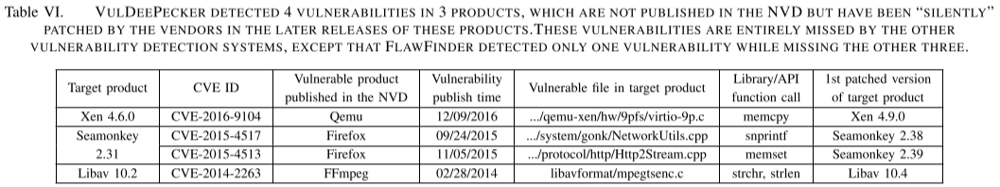

# 局限性

VulDeePecker目前的设计，实施和评估有一些局限性，这些局限性表明了未来研究可以研究的问题。首先，VulDeePecker的当前设计仅限于通过假设程序的源代码可用来处理漏洞检测。检测可执行文件中的漏洞是一个不同且更具挑战性的问题。

其次，VulDeePecker的当前设计仅涉及C/C ++程序。未来的研究可以使其适应其他类型的编程语言。

第三，VulDeePecker的当前设计仅处理与库/API函数调用相关的漏洞。我们将研究如何通过利用上面提到的其他类型的关键点来检测其他类型的漏洞。

第四，尽管代码gadgets的概念可以适应数据依赖性和控制依赖性，但VulDeePecker的当前设计仅适用于数据流分析（即数据依赖性），而不适用于控制流分析（即控制依赖性）。未来的重要工作是提高数据流分析的杠杆作用并适应控制流分析以增强漏洞检测功能。

第五，VulDeePecker的当前设计使用一些启发式方法来标记代码gadgets：将代码gadgets转换为其符号表示，将代码gadgets的可变长度向量表示转换为固定长度向量。虽然直观，但还需要进行进一步的研究，以确定这些启发式方法对VulDeePecker有效性的影响。

第六，VulDeePecker的当前实现仅限于BLSTM神经网络。我们计划用其他可用于漏洞检测的神经网络进行系统实验。

第七，目前对VulDeePecker的评估是有限的，因为数据集只包含缓冲区错误漏洞和资源管理错误漏洞。未来我们将对所有可用类型的漏洞进行实验。

虽然我们针对3种软件产品（即Xen，Seamonkey和Libav）进一步测试了VulDeePecker，发现4个漏洞未在NVD中报告，并且在发布这些产品的更高版本时被供应商“默默”修补，这些漏洞是已知而不是0-day。需要针对更多软件产品进行大量实验，以检查VulDeePecker是否具有检测0-day漏洞的能力。这在理论上是可行的，因为VulDeePecker使用基于模式的方法。

# 结论

我们提出了VulDeePecker，这是第一个基于深度学习的漏洞检测系统，旨在减轻人们手动定义规则和减少其他漏洞检测系统所带来的漏报。由于深度学习是针对与漏洞检测非常不同的应用而发明的，因此我们提出了一些初步原则，用于指导将深度学习应用于漏洞检测的实践。这些原则应该进一步完善，因为深度学习在解决漏洞检测问题方面具有巨大潜力。我们收集并公布了一个有用的数据集，用于评估VulDeePecker和其他将在未来开发的基于深度学习的漏洞检测系统的有效性。系统实验表明，VulDeePecker可以比其他漏洞检测系统实现更低的漏报率，同时使人们免于手动定义功能。对于我们试验过的3种软件产品（即Xen，Seamonkey和Libav），VulDeePecker检测到4个漏洞，这些漏洞未在NVD中报告，并且在发布这些产品的更高版本时被供应商“静默”修补。相比之下，其他检测系统几乎漏掉了所有这些漏洞，除了一个系统检测到其中一个漏洞但错过了其他三个漏洞。

未来研究的开放性问题很多，包括本研究的局限性。特别是，精确表征基于深度学习的漏洞检测的能力和局限性是一个令人兴奋的研究问题。

