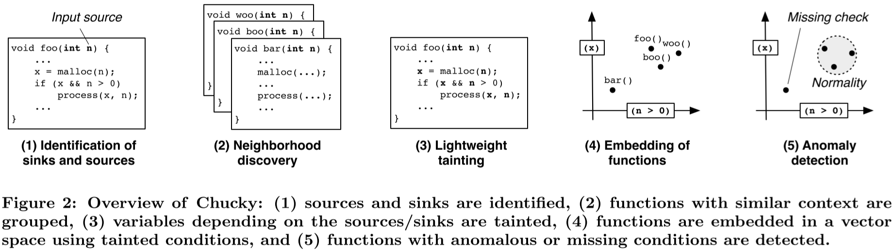
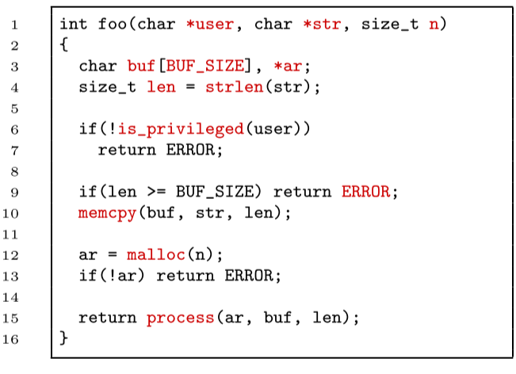
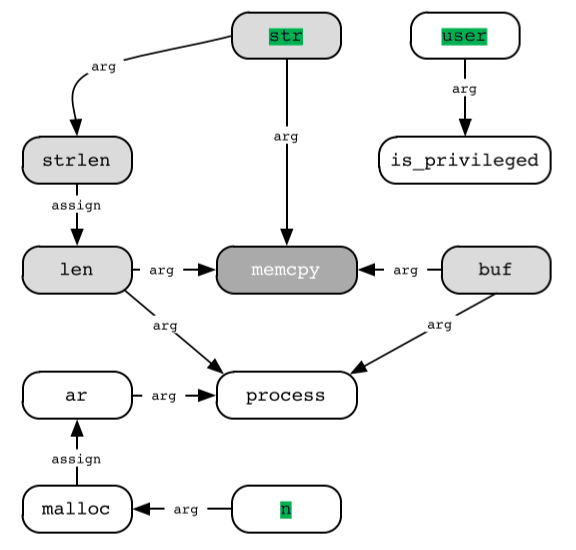
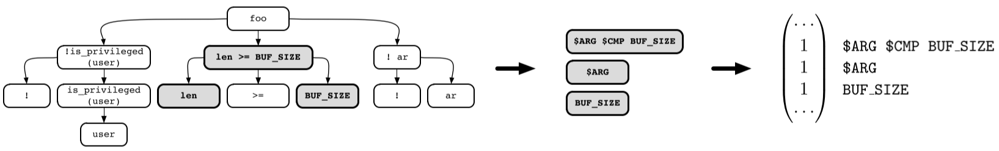

本文设计CHUCKY，结合污点传播和机器学习发现代码中缺失检查的问题。具体来说，因为在一个程序中，相同的污点传播规则（Source和Sink）会命中很多个代码片段，而又因为通常只有少数代码片段有问题，因此可以对其进行聚类，那些不合群的小部分代码片段就有可能存在漏洞。

# Methodology

CHUCKY将检查步骤分为5步：

## 0x01 代码解析

1. source和sink：对于一个函数来说，所有的参数，全局和局部变量都被标记

2. API符号，抽取API用于相似函数的发现
3. 赋值语句，赋值描述了变量间的信息流，我们保存AST的左右子树
4. 条件语句，我们保存条件表达式的完整AST，而不是字符串

（这里感觉就是介绍怎么做污点传播的）

## 0x02 用NLP的一些方法寻找相似的函数

相似的函数会使用相同的API，因此使用词袋模型（实际上使用的TF-IDF），接着我们选择向量间最近的k个函数

## 0x03 污点传播

如foo()的污点传播依赖图如下，遇到函数边界污点不传播

## 0x04 将函数映射到向量空间

我们运用了与0x02类似的方法，但是这里我们提取的是表达式的特征，并且 在之前我们做了预处理：

1. 将条件语句中的判断换成`$CMP`，将所有数字换成`$NUM`，例如$x>10$与$x<1+9$是等价的

2. 将返回值统一为`$RET`，将变量重命名为`$ARG`

过程如下图所示

## 0x05 寻找离群的函数，将其视为漏洞