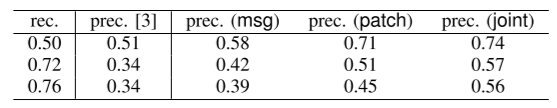
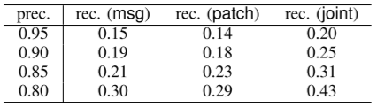

**来源：**Sabetta A, Bezzi M. A practical approach to the automatic classification of security-relevant commits[C]//2018 IEEE International Conference on Software Maintenance and Evolution (ICSME). IEEE, 2018: 579-582.

本文结合了commit的log和code，以此识别commit时否与安全有关。经过实验，该模型有80%的准确率和43%的召回率。

# 研究意义

1. 根据统计，有25%的开源项目存在静默修复的行为
2. 即使上报CVE，也存在数据库收录不及时的情况
3. 手动识别commit是否与安全相关浪费大量人力
4. 只从commit的log信息判断是否时安全性问题时困难的：
   1. log本身的信息量不大
   2. 很多厂商会在log中回避安全相关的字眼，以防止攻击者识别，展开1day攻击

# 方法

先前的方法只考虑了commit log信息，而本文将patch code也当成自然语言数据，从两方面进行分类。

## Log Message Classifier

对于Log，使用词袋（bag of words）提取其特征，去除停用词，将其作为向量输入SVM，产生模型。

## Patch Classifier

对于代码，考虑到其变量名，类名方法名等也包含分类特征，因此将其视为自然语言，通过预处理之后训练SVM模型。

## 投票机制

两个分类器采取或逻辑，只要有一个判断为与安全相关的commits，则整体模型判断为与安全相关的commits。

# 实验

本文选择了“Beyond metadata: Code-centric and usage-based analysis of known vulnerabilities in open-source software”文中的数据集，首先，我们选择了数据集的456个与安全相关的commits（正例），接着，对于每一个正例，我们在其对应仓库的commits中选择5个反例——因为存在严重数据倾斜。

通过10折实验，我们有如下数据：

# 总结

SAP一帮人发在ICSME18 Industry Track上的一片文章，用到的技术比较水，没啥亮点，实验做的也很有问题，但是其提出的研究意义需要我们关注，如果日后要做相关内容不可避免会遇到相似问题。