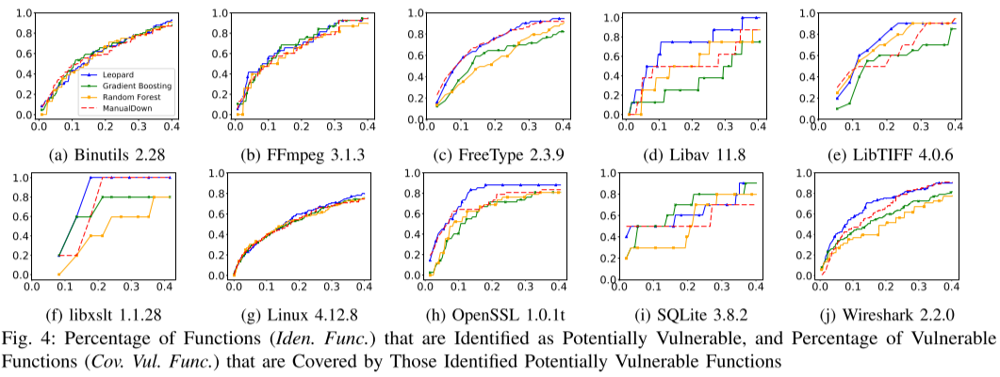

# LEOPARD:通过程序指标为漏洞评估识别易受攻击代码

**摘要：**识别代码库中潜在的易受攻击的位置对于有效的漏洞评估是一个关键步骤；它可以极大地帮助安全专家将时间和精力投入到最需要的地方。目前研究已经提出了基于度量和基于模式的方法来识别易受攻击的代码。前者依赖于机器学习，并且由于非易受攻击和易受攻击的代码之间的严重不平衡或缺乏表征漏洞的特征而无法正常工作。后者需要已知漏洞的先验知识，并且只能识别类似但不是新类型的漏洞。

在本文中，我们提出并实现了一个通用的、轻量级的、可扩展的框架LEOPARD，通过程序度量来识别潜在的脆弱函数。LEOPARD不需要预先了解已知的漏洞，它有两个步骤，首先，它使用复杂性度量将目标应用程序中的函数分到一个集合中。然后，它使用漏洞度量对每个集合中的函数进行排序，并将排名靠前的函数标识为潜在的漏洞。我们在11个实际项目上的实验结果表明，LEOPARD通过识别20%的脆弱函数，可以覆盖74.0%的脆弱函数，性能优于基于机器学习和基于静态分析的技术。我们进一步提出了LEOPARD的三个应用程序，它们被用来进行手工代码审查和fuzzing，通过这三个应用程序，我们在实际应用程序（PHP、radare2和FFmpeg）中发现了22个新的bug，其中8个是新的漏洞。

# 简介

漏洞是软件安全的主要威胁之一。安全专家通常利用引导式模糊测试，符号执行或手动审计来挖掘漏洞。由于在大型代码库中只有少数漏洞，因此漏洞挖掘是一项非常具有挑战性的任务，需要丰富的知识，这与“大海捞针”相当。同时，人们在分析非易受攻击的代码时浪费了大量的时间和精力。从这个意义上讲，识别代码库中潜在易受攻击的代码可以指导漏洞挖掘的方向。

有两种现有技术可以自动识别漏洞：基于度量和基于模式的技术。基于度量的技术受到bug预测的启发，利用有监督或无监督的机器学习在源文件的粒度级别预测易受攻击的代码。安全专家认为复杂性是软件安全的敌人，因此他们使用复杂度指标作为特征，或者将它们与代码流失指标相结合，单词频率度量，依赖度量，开发者活动度量和执行复杂性度量。另一方面，基于模式的技术利用已知漏洞的模式通过静态分析识别潜在的易受攻击的代码。这些模式是基于某种类型漏洞的语法或语义抽象而制定的，例如，缺少对安全关键对象，安全属性，代码结构和漏洞规范的安全检查。

虽然漏洞挖掘引起了极大的关注，但仍存在一些问题。一方面，基于度量的技术主要是针对单个应用程序（或相同类型的一些应用程序）而设计的，又因为机器学习可能会过拟合，因此，它们可能不适用于不同的应用，。此外，虽然存在漏洞和漏洞之间的经验关联，但由于漏洞和漏洞之间的差异，连接相当薄弱。因此，对bug预测的研究不能直接转化为漏洞识别。遗憾的是，现有的基于度量的技术使用与错误预测相似的指标，因此无法调查漏洞的特征。

另一方面，基于度量和基于模式的技术通常需要大量关于漏洞的先验知识。特别是，在一些基于度量的技术中，需要大量已知的漏洞来进行有效的监督机器学习。而漏洞的数量远远小于漏洞的数量，非脆弱和易受攻击的代码之间的不平衡是严重的，这阻碍了监督机器学习的适用性。同样，这些基于模式的技术的先决条件是存在已知的漏洞作为制定模式的指南。他们只能识别相似但不是新的漏洞。此外，模式通常是特定于应用程序的，因此这些技术通常用作项目内但不是跨项目的易受攻击的代码识别。

在本文中，我们提出了一个名为LEOPARD的漏洞识别框架，用于挖掘C/C ++应用程序中可能存在漏洞。 LEOPARD旨在跨越不同类型的应用程序，支持大规模应用程序的分析，并可通过特定于域的数据进行扩展，以提高准确性。我们将LEOPARD设计为漏洞评估的前期步骤，但不是直接查明漏洞。我们提出了LEOPARD的三种不同应用，通过缩小潜在易受攻击函数的搜索空间，在手动审计或自动模糊测试期间指导安全专家。

LEOPARD不需要任何有关已知漏洞的先验知识。它通过组合两组系统导出的程序指标（即复杂性指标和漏洞指标）分两步工作。复杂性度量在两个互补维度中反映函数的复杂性：函数的圈复杂度和函数中的循环结构。漏洞度量标准反映了三个维度中功能的易受攻击的特征：函数的依赖性，函数中的指针使用以及函数内控制结构之间的依赖性。

LEOPARD首先使用复杂度指标将目标应用程序中的函数分为一组集合。然后，LEOPARD利用漏洞度量标准对每个集合中的函数进行排名，并将每个集合中的排名靠前函数标识为可能存在漏洞。我们提出这样的分级和排序方法，因为在复杂性和漏洞度量之间经常存在比例关系，这在我们的实验研究中得到证实。因此，每个集合都有不同的复杂程度，我们的框架可以识别各种复杂程度的漏洞，而不会错过低复杂性的漏洞。

我们实现了我们提出的框架，以获得C/C++程序的复杂性和漏洞度量。我们使用11种不同类型的实际项目评估了框架的有效性和可扩展性。 LEOPARD可以通过将20％的功能识别为潜在易受攻击来覆盖74.0％的易受攻击的功能，优于基于机器学习和基于静态分析的典型技术。应用LEOPARD进一步手动审计或自动模糊测试，我们在在PHP，MJS，XED，FFmpeg和Radare2中发现了22个新漏洞，其中8个是新的漏洞。

总之，我们的工作做出了以下贡献。

* 我们提出了一个通用的，轻量级的，可扩展的框架来识别潜在的易受攻击的函数，使用两组评估指标。
* 我们提出了LEOPARD的三种不同应用程序，以指导安全专家在手动审计或自动模糊测试中寻找漏洞。
* 我们运行了框架并对11个实际项目进行了大规模实验，以证明我们框架的有效性和可扩展性。
* 我们运行了框架的三个应用程序，发现了22个新bug。

# 方法

在本节中，我们将介绍LEOPARD的并详细说明方法的每个步骤。

## A. 概述

图1显示了LEOPARD的工作流程，该设计旨在通用，轻便且可扩展。输入是C/C++应用程序的源代码。 LEOPARD分两步工作：函数分类和函数排名，并返回可能存在漏洞的函数列表。在第一步（II-B节）中，我们使用复杂度指标将目标应用程序中的所有函数分为一组集合。复杂性度量在两个维度上反应函数的复杂性：函数本身（即，圈复杂度）和函数中的循环结构（例如，嵌套循环的数量）。每个函数具有不同的复杂程度，旨在识别各种复杂程度的漏洞（即，避免漏掉具有低复杂性却易受攻击的函数）。

在第二步（II-C节）中，我们使用漏洞度量标准对每个集合中的函数进行排名，以便将每个集合中的排名靠前的函数标识为可能存在漏洞。漏洞度量在三个维度中捕获函数的易受攻击的特征：函数的依赖性（例如，参数的数量），函数中的指针使用（例如，指针算术的数量）以及控制结构的依赖性（例如，嵌套控制结构的数量）。通过整合这些指标，我们可以很有可能表示和识别易受攻击的函数。

LEOPARD旨在支持和促进漏洞挖掘，例如，在自动模糊测试期间指导安全专家或通过提供可能易受攻击的函数列表和相应的度量信息进行手动审计。有了这些知识，安全专家可以优先考虑评估顺序，选择合适的分析技术，并分析根本原因。此外，基于特定于应用程序的领域知识（例如，漏洞历史和大量模糊的功能列表），安全专家可以进一步对可能易受攻击的功能进行排名或过滤，以专注于那些更有趣的功能。

通过简单的分类和排序方式使用程序指标，使LEOPARD满足我们的通用和轻量级设计原则。它适用于任何类型的大规模应用程序，并且不需要有关已知漏洞的先验知识。这两组度量标准是全面的，但随着我们从安全专家那里收集更多的使用反馈，我们也可以使用新指标进行扩展（请参阅第五节中的讨论）。因此，LEOPARD还满足了我们可扩展的设计原则，使其可以进一步增强。

## B. 函数分类

不同的漏洞通常具有不同的复杂程度。为了识别各种复杂程度的漏洞，在第一步中，我们将目标应用程序中的所有函数按复杂度指标分类。结果，每个集合代表不同的复杂程度。之后，第二步（II-C节）通过排名进行预测。这种分类和排序方法旨在避免遗漏低复杂性却易受攻击的函数。

**复杂度指标。**通过“复杂性”，我们引用函数中的近似路径数，并从结构复杂度中导出函数的复杂度度量。函数通常具有循环和控制结构，这是结构复杂性的主要来源。 Cyclomatic复杂度是一种广泛使用的衡量复杂性的指标，但没有反映环路结构。基于这样的理解，我们引入了关于这两个互补维度的函数的复杂性，如表I所示。

**函数度量（C1）**反应函数的标准圈复杂度，即线性相关路径的数量。C1的较高意味着该函数可能更难以分析或测试。

**循环结构度量（C2-C4）**反映了循环产生的复杂性，这可以大大增加函数中的路径数量。度量标准包括循环数，嵌套循环数和循环的最大嵌套级别。循环在程序分析[68]中具有挑战性，并阻碍了漏洞分析。基本上，这些指标越高，需要考虑的路径就越多（也可能更长），分析功能就越困难。

**分类策略。**给定目标应用程序中函数的这些复杂性度量的值，我们通过将所有复杂性度量值相加来计算每个函数的复杂度分数，然后将具有相同分数的函数分组到同一个集合中。这里我们不使用基于范围的分箱策略（即，将分数落入相同范围的函数分组到相同的分箱中），因为难以确定该范围的合适粒度。这种简单的策略不仅使我们的框架轻量化，而且效果也很好，正如我们在IV-C节中实验研究所证明的那样。

## C. 函数排名

与结构复杂性度量不同，在第二步中，我们根据漏洞的一般原因的特征推导出一组新的漏洞度量，然后对每个集合中的函数进行排名并将其识别为潜在易受攻击的基于漏洞指标。现有的基于度量的技术很少采用任何面向漏洞的度量标准，并且不区分复杂性度量标准和漏洞度量标准。在这里，我们提出并纳入漏洞度量标准，以便具有表征和识别易受攻击的功能的巨大潜力。

**漏洞指标。 **C/C++程序中最关键的漏洞类型直接或间接地由内存管理错误和对某些敏感变量（例如指针）的缺失检查引起。产生的漏洞包括但不限于内存错误，访问控制错误（例如，缺少对用户权限的检查）和信息泄漏。实际上，许多拒绝服务和代码执行漏洞的根本原因也可以追溯到这些原因。上述类型占所有漏洞的70％以上。因此，可以定义一组与主要漏洞类型兼容的漏洞度量标准。在这里，我们不针对任何特定类型的漏洞，例如，包括与除零操作密切相关的划分操作等指标，而对特定类型的指标在未来是值得研究的方向。对于高或低复杂度分数，我们关注的易受攻击的函数主要是复杂和紧凑的计算，它们与函数中的路径数无关。基于这些观察，我们引入了函数w.r.t的漏洞度量。其有三个维度，如表II所示。

**依赖性度量（V1-V2）**表示函数与其他函数的依赖关系，即函数的参数变量的数量和函数作为函数调用的参数准备的变量的数量。函数越依赖于其他功能，越难以跟踪交互。

**指针度量（V3-V5）**捕获指针的操作，即指针算术的数量，指针算术中使用的变量的数量，以及变量所涉及的指针算术的最大数量。成员访问操作（例如，ptr→m），定义操作（例如，*ptr），递增指针（例如，ptr ++）和递减指针（例如，ptr--）都是指针算术操作。可以通过简单计数从函数的抽象语法树（AST）获得指针运算的数量。这些操作与敏感的内存操作密切相关，这会增加内存管理错误的风险。

与此同时，我们计算在指针算术运算中使用了多少个唯一变量。涉及的变量越多，程序员做出正确决策的难度就越大。对于这些变量，我们还检查它们涉及多少指针算术运算并记录最大值。对同一指针的频繁操作使得更难跟踪其值并保证正确性。总之，这些指标越高，引发复杂内存管理问题的可能性就越大，例如取消引用null或越界指针的可能性就越大。

**控制结构度量（V6-V11）**挖掘由于高度耦合和依赖控制结构（例如_if_和_while_）的漏洞，即嵌套控制结构的数量，没有显式_else_语句的_if_结构数，以及控制结构中涉及的变量数等。我们用计算Fibonacci系列的例子（图2）解释了上述指标。有两对嵌套控制结构，第7行的_if_、第8行的_if_和第12行的_for_。显然，最大嵌套级别为2，其发生在第7行的_if_。控制依赖的控制结构最大值为3，包括第7行和第8行_if_，以及第12行_for_。数据依赖的控制结构最大数目为4，因为四个控制结构都与n有关。所有三个_if_语句都没有_else_分支。有两个变量，即_n_和_i_涉及控制结构的谓词。实际上，谓词中使用的变量越多，就越有可能在完整性检查中产生错误。指标越高，程序员越难以遵循，并且在漏洞挖掘期间更难以达到函数的更深层次。缺少检查的隐式分支是可疑的。

复杂性和漏洞度量之间通常存在比例关系，因为函数的（独立路径和循环）结构越复杂，变量，指针和耦合控制结构就越有可能出现漏洞。复杂度度量用于估计函数中的路径数量，这对于易受攻击的特征是合适的。重要的是，对于用作漏洞指标的控制结构，它们描述了属性的不同方面而不是复杂度指标。首先，控制结构是嵌套的还是依赖的，或者_if_是否跟随_else_，这与复杂度指标无关。其次，密集耦合的控制结构是脆弱性的良好证据。我们提出了一种分类和排序方法，以避免错过不太复杂但易受攻击的功能，而不是直接对具有复杂性和漏洞度量的功能进行排序，这将在IV-B节中得到证明。

**排序策略。**根据函数的这些度量值，我们通过将所有度量值相加，根据得分对每个集合中的函数进行排名，并累积识别每个集合中得分最高的函数，为每个函数计算漏洞得分作为存在脆弱点的可能性。在选择期间，我们从每个集合中识别k个函数，其中k最初为1，并且在每个选择迭代中增加1。请注意，我们可能需要多于k个函数，因为我们对具有相同分数的函数进行相同处理。当选择了适当的部分（即p）函数时，该选择停止。这里p可以由用户设置。与分箱策略类似，我们采用简单的排名策略，使我们的框架既轻量又有效。

# LEOPARD的应用

LEOPARD的目的不是直接查明漏洞，而是协助确认漏洞评估。 LEOPARD输出具有复杂度指标和漏洞度量标准得分的潜在易受攻击功能列表，这可为进一步的漏洞搜索提供有用的见解。在本节中，我们将演示三种不同的方法来应用LEOPARD生成的结果来查找漏洞。通过LEOPARD，我们在五个广泛使用的真实世界程序中发现了22个新错误。详细的实验结果将在IV-F中介绍。

**手动审计**，通常在LEOPARD的帮助下，可以大大改善手动审计（例如代码审查）的有效性和效率。安全专家不仅可以审核所有功能，还可以只关注LEOPARD识别的那些可能易受攻击的功能。

此外，LEOPARD生成的漏洞指标可以帮助安全专家利用其领域知识快速识别漏洞的根本原因，尤其是对于复杂的大型程序功能。例如，如果易受攻击的函数具有大量if-without-else的实例，安全专家可以关注其他缺失的逻辑以查看是否存在潜在的缺失检查；如果易受攻击的函数有大量指针，安全专家可以专注于内存分配和释放操作，以查看是否存在潜在的悬空指针。虽然这些指标无法直接指出根本原因，但它可以提供有关可能根本原因的明确提示。

**定向模糊测试的目标识别。**模糊测试已被证明是一种有效的测试技术，其可以发现漏洞。具体来说，灰盒Fuzzer（例如，AFL及其变体）已经获得了普及，并且已被证明可用于在实际应用中发现漏洞。

当前的灰盒Fuzzer旨在在给定的时间预算内覆盖尽可能多的程序状态。然而，更高的覆盖率并不一定意味着发现更多的漏洞，因为模糊测试者盲目地探索所有可能的程序状态而不将工作重点放在更易受攻击的功能上。最近，定向灰盒Fuzzer（例如，AFLGo和Hawkeye）被提议用于引导模糊执行到预定义的易受攻击的功能（也称为目标站点），以重现漏洞或检查补丁功能是否仍然易受攻击。

由于LEOPARD产生潜在的易受攻击的函数列表，一个直接的应用就是使用LEOPARD指导灰盒Fuzzer的测试。通过这种方式，我们可以通过引导Fuzzer专注于某些函数来快速确认潜在的函数是否真正易受攻击。请注意，虽然Fuzzer可以达到存在漏洞你的函数，但也可能无法始终触发。但是，定向模糊测试已被证明是一种重现漏洞的有效的技术。为了证明这个想法，我们使用定向模糊测试工具Hawkeye，它基于可扩展的模糊框架FOT并且实验说明其效果优于ALFGo [13]。但是，由于LEOPARD产生了大量潜在的易受攻击的功能，将所有潜在的易受攻击的功能设置为目标是无效的，因为它可能会混淆Fuzzer。为此，我们选择将目标应用程序分离为基于其体系结构设计或简称命名空间的较小模块，然后让Hawkeye对分别按模块分组的目标进行模糊测试。

**模糊测试的种子优先排序**，灰盒Fuzzer通常会保留有趣的测试输入（即种子）以进行进一步的模糊测试。因此需要不断评估这些种子，以确定应优先考虑哪些种子。默认情况下，大多数Fuzzer（例如，AFL）更喜欢具有“较小文件大小”和“较短执行时间”或“更多边缘（基本块过渡）覆盖”的种子，这些不是针对于漏洞感知的标准。

由于LEOPARD为每个功能分配了漏洞分数和复杂性分数，我们可以使用这些分数来帮助评估应该优先考虑哪个种子，以便Fuzzer可以在给定的时间预算中找到更多漏洞。为此，我们扩展了FOT，使其能够接受种子优先级的外部分数。详细的种子评估过程解释如下。首先，我们根据分箱和排名策略计算每个函数的优先级分数。对于Top-K的函数F，其优先级分数使用以下公式计算：

其中Ni是具有排名至i的函数的数量，N是所有函数的总数。例如，如果前1个函数贡献了所有函数总数的20％的一部分，则为这些函数分配80（100-20）的分数。然后，将函数得分映射提供给FOT。在执行测试输入（即种子）之后，Fuzzer可以获得由函数组成的执行跟踪。然后，Fuzzer将累积执行跟踪上的函数的优先级分数，以形成该路径的优先级分数。结果，每个种子与表示其易受攻击性的路径优先级分数相关联。当Fuzzer选择下一个种子模糊时，它将选择具有最高跟踪优先级分数的种子。

# 评估

LEOPARD以11K的Python代码行实现。具体来说，我们使用Joern来提取复杂性和漏洞度量的值，给定应用程序的源代码。有关实施和评估的更多详细信息，请访问我们的网站。

## A. 评估设置

**目标应用。**我们使用了11个真实的开源项目，代表了各种各样的应用程序。 BIND是使用最广泛的域名系统（DNS）软件。 Binutils是二进制工具的集合。 FFmpeg是领先的多媒体框架。 FreeType是一个用于渲染字体的库。 Libav是一个处理多媒体数据的库，最初是从FFmpeg派生出来的。 LibTIFF是一个用于读取和写入标记图像文件格式（TIFF）文件的库。 libxslt是GNOME项目的XSLT C库。 Linux是一个类似Unix的计算机操作系统内核。 OpenSSL是一个功能强大且功能齐全的工具包，适用于传输层安全性（TLS）和安全套接字层（SSL）协议。 SQLite是一个关系数据库管理系统。 Wireshark是一个用于Unix和类Unix操作系统的网络流量分析器。

表III列出了每种目标应用的详细信息。第一列提供项目版本，第二列提供源代码行，第三列列出每个项目中的功能总数。最后三列报告了脆弱功能的数量，CVE以及从我们的研究中排除的CVE。在这里，我们选择了具有大量CVE项目的最新版本。函数的数量范围从666到libxslt到488,960（对于Linux）来说，它的多样性足以显示我们框架的通用性。我们总共研究了26,886K代码行和600,825个函数，研究规模大，结果可靠。

**基本事实**，为了获得评估LEOPARD有效性的基本事实，我们首先手动确定了2018年7月之前在两个漏洞数据库网站上11个项目中披露的漏洞列表：CVE详细信息库和国家漏洞数据库，即，我们从发布日期到2018年7月收集了针对给定版本项目报告的所有漏洞。

大多数项目中的CVE完整列表由上述两个网站记录。然而，CVE的补丁没有很好地维护并且难以收集。我们在一个行业实验室的11个项目中获得了这些CVE的可用补丁，他们为C/C++程序提供漏洞扫描服务。那些被打补丁的函数被标记为脆弱函数。结果报告在表III的第四和第五列中。例如，我们在我们的网站上显示了Libav的CVE列表，可用补丁和相应的补丁功能。

一些CVE未能包括在我们的研究中，如表III的最后一栏所示，因为（i）没有公开详细说明可以直接识别的易受攻击的函数，因为CVE受某些封闭源项目或其他原因影响（例如，针对SQLite 3.8.2的CVE-2015-6607和CVE-2015-5895）;（ii）该修复不涉及函数的直接代码更改（例如，Wireshark 2.2.0和CVE-的CVE-2016-7958） 2016-2183 for OpenSSL 1.0.1t）。

**研究问题**，我们设计实验来回答以下研究问题：

* Q1：排序步骤之前的分类步骤是否合理？（IV-B）
* Q2：我们的分类和排名方法是否有效，是否能够超越基线方法、基于机器学习的技术和一些现成的静态扫描器？（IV-C）
* Q3：指标对我们框架有效性的敏感性是什么？（IV-D）
* Q4：我们框架的性能开销（即可扩展性）是多少？（IV-E）
* Q5：LEOPARD的潜在应用场景是什么？（IV-F）

## B. 排序前的分类合理性（Q1）

为了回答这个问题，我们首先计算了所有项目中每个函数的复杂性得分和漏洞得分。然后，我们使用对数标度在图3中绘制了复杂性得分（即x轴）与脆弱性得分（即y轴）之间的关系，其中脆弱和非脆弱功能分别以红色和蓝色突出显示。 BIND的结果因空间限制而被省略，但可以在我们的网站上找到。

从图3可以看出，所有的项目都有相似的模式；脆弱函数分布在非脆弱函数w.r.t.复杂度和脆弱性得分中；脆弱函数的复杂度得分与脆弱性得分之间存在近似正比关系。因此,如果我们直接基于功能复杂性度量或脆弱性指标排名，我们将永远得到复杂性高和脆弱性高的函数，并错过得分低但脆弱的函数(例如，在图3a，3g，3j中，位于前3个集合中的脆弱的函数)。相反，通过首先根据复杂度得分对函数进行划分，然后根据脆弱性得分对每个集合中的函数进行排序，我们的框架可以有效地识别所有复杂度级别上潜在的脆弱函数(详见IV-C节)。在所有11个项目中，集合的数量从56个到206个不等，平均114个。每个集合平均有301个函数，22%的集合含有易受攻击的函数。有关集合函数分布的详情，请浏览我们的网站。从图3可以看出，复杂度得分越小的集合函数越多，复杂度得分越高的集合函数越少。具有较大复杂性得分的集合的稀疏性有利于选择最脆弱的函数，而我们在具有较小复杂性得分的集合中的排名使我们有更多机会识别不那么复杂但脆弱的函数。此外，图3还直观地显示了非脆弱函数和脆弱函数之间的严重不平衡(见表三的第三和第四列)，这表明传统的机器学习将会过度拟合，效率也会降低(详见IV-C节)。

**我们通过分类和排序方法的预测是合理的，因为其考虑到了脆弱函数具有不同的复杂性。**

## C. 分类和排序方法的有效性 (Q2)

我们在所有项目上运行LEOPARD；并分析其在选择不同函数部分时的有效性，即，选择排序步骤中的参数p(参见II-C节)。这里，我们使用了LEOPARD识别为潜在易受攻击的函数的百分比（即：_Iden.Func._）和易受攻击函数的百分比（即_Cov.Vul.Func_）这两个指标。

结果如图4所示，其中x轴表示_Iden.Func._, y轴表示c。为了清晰起见，图4a中只显示了图例，其余部分省略；BIND的结果被省略，但是可以在网站上找到。一般来说，随着_Iden.Func._的增加，指标_Cov.Vul.Func_也会增加。对于较小的I值(例如，20%)，我们的分类再排序方法可以为_Cov.Vul.Func_实现较高的值(例如，74%)。此外，我们在表四中还报告了确定一定比例的函数为脆弱函数时，工具覆盖了多少脆弱函数。当确定5%、10%、15%、20%、25%和30%的函数为脆弱函数时，我们工具可以覆盖29%、49%、64%、74%、78%和85%的脆弱函数。这意味着LEOPARD缩小了安全专家的评估空间。

**与基线方法比较。**最近的一项对42个现有的跨项目缺陷预测模型和两个最先进的无监督缺陷预测模型的研究表明，简单地根据源代码行(SLOC)对函数进行排序，即递增（ManualUp）或递减（ManualDown），可以实现大多数缺陷预测模型类似甚至更好的预测性能。我们将递增的结果(这比LEOPARD差很多)放在我们的网站上，并且在本节中只显示递减的结果。

图4比较了LEOPARD和ManualDown在每个项目上的表现。LEOPARD为所有项目显示了更好的结果，除了Binutils和FreeType。平均而言，与ManualDown相比，LEOPARD识别15%、20%和25%的脆弱功能时，分别取得9.2%、10.3%和7.4%的改善，如表V所示;我们识别的代码(以SLOC计算)比ManualDown少15.6%、13.8%和11.8%。平均而言，96.8%的ManualDown的正确结果被LEOPARD覆盖。这证明了LEOPARD的有效性。

**与基于机器学习的技术比较。**我们还通过随机森林(RF)、梯度增强(GB)、朴素贝叶斯(NB)和支持向量分类(SVC)四种基于机器学习的技术对我们的框架进行了实验比较。四个技术使用所有4个复杂性度量和11个脆弱性指标的特性，并进行跨项目预测。首先从11个项目中的10个项目训练模型，然后利用模型在另一个项目中预测脆弱的函数。通过轮换项目进行预测，我们得到了11个项目的预测结果。较大的预测概率表明函数更容易受到攻击。我们根据概率对函数进行排序，并将一组高概率函数确定为脆弱函数。当确定相同数量的函数时，可以与LEOPARD进行公平的比较。结果如图4和表V所示。

如图4所示，RF和GB的一个明显缺点是不同项目之间的性能不稳定。这表明，机器学习方法高度依赖于各种易受攻击函数的庞大知识库，而这些知识库是很难获得的。具体来说，RF在图3a和图3b中仅表现出与LEOPARD相似或略好于LEOPARD的性能，而GB在图3a、图3b和图3i中仅表现出类似的性能。LEOPARD在图3c、3d、3e、3f、3g、3h和3j上的表现优于RF和GB。RF和GB的性能甚至比图3c、3h和3j中的ManualDown基线还要差。如表V所示，当识别20%的函数时，RF和GB分别比LEOPARD少覆盖15.2%和13.1%的样本。同样，LEOPARD并不依赖于关于大量漏洞的任何先验知识，而是基于机器学习的技术依赖它们。NB和SVC在四种典型的机器学习算法中召回率极低。因此，我们省略了结果，并把他们放在我们的网站。注意，11个项目可能不是训练和测试的充分数据集，特别是考虑到脆弱和非脆弱功能之间的严重不平衡，得出的结论的有效性可能受到威胁。但是，对摆脱易受攻击函数的先验知识依赖性促使我们设计了LEOPARD。

**与静态扫描器比较。**我们还应用了两个流行的静态软件扫描器工具来研究它们在我们的数据集中的漏洞预测能力，包括一个开源工具Cppcheck[10]和一个商业工具。为了避免法律纠纷，我们隐藏了商业名称，称其为S。Cppcheck和S是最流行的静态代码分析工具，用于检测软件中的bug和漏洞。这两种工具都报告了可疑的易受攻击语句。每当警报位于我们的真实的脆弱函数中时，我们就认为该工具发现一个正例。这两个工具报告的漏洞总数和召回数量见表六。Cppcheck能够分析所有11个项目，并在Binutils、FreeType和Wireshark中识别出一些易受攻击的功能。S分析Linux失败了，在其他10个项目中，其只在LibTIFF中检测到少数易受攻击的函数。静态扫描器通常依赖于非常具体的漏洞模式。细微的模式不匹配会导致误报和漏报。因此。它们的召回率接近于0，这表明它们不太可能用于一般的漏洞识别。

**漏报分析。**通过对LEOPARD在识别40%函数时未能覆盖的脆弱函数进行分析，总结出造成漏报的三个主要原因:1)涉及到一些难以被函数度量揭示的逻辑漏洞;2)通过一些与CVE间接相关的修复方法修复的漏洞，例如，如果修复中更改了函数签名，则不应将该函数的调用者视为脆弱的；或者3)安全关键信息在其周围的环境中，不被函数本身所看到，例如，复杂指针偏移量的计算有时是通过一个单独的函数来完成的，在这个函数中不能推断出指针指标，从而导致漏洞得分较低。对于第一种情况，此类漏洞通常很难通过静态分析来识别，因此不应该成为我们的方法所关注的问题。情形二也与我们方法的有效性无关。第三种情况的缓解方法是将污染信息包含到我们的漏洞度量中，这将在第V节中讨论。

**误报分析。**平衡通用性、准确性和可伸缩性一直是静态分析中一个非常具有挑战性的任务。由于LEOPARD旨在揭示一般的漏洞，因此不可能避免误报。然而，LEOPARD的目标是帮助脆弱性评估，而不是一个独立的静态分析工具。因此，误报分析并不是评估其能力的关键标准。此外，一些漏洞以前在历史上被修补过、秘密修补过或目前未公开，因此无法确认它们是否确实是误报。这也反映在IV-F节的实验中，我们在报告中潜在的脆弱函数中发现了新的漏洞。

我们的分类排序方法是有效的，即，识别20%的脆弱函数，平均覆盖74.0%的脆弱函数。对于安全专家来说，这一小部分函数非常有用，我们将在IV-F节中对LEOPARD的应用程序中说明这一点。此外，LEOPARD优于基于机器学习的技术和基于静态分析的方法。

## D. 度量的敏感性（Q3）

为了评估复杂性和漏洞度量对框架的敏感性，我们从LEOPARD中删除了复杂性和漏洞度量的一个维度，然后在所有项目上运行LEOPARD。我们在图5中展示了复杂度度量和漏洞度量的敏感性结果。x轴和y轴表示I和召回量(即， C)。去掉度量的一个维度后，每个项目在标识一定百分比的函数时的收回增量都用蓝色叉号标记，其中正增量表示性能的提高，负增量表示性能的下降。红点是所有11个项目的平均召回增量。

**复杂度度量对LEOPARD有重要的贡献；而且很难得到一个适用于所有项目的最优度量模型，因此我们需要开发通用模型。**

## E. 架构的可伸缩性(Q4)

为了评估框架的可伸缩性，我们收集了利用LEOPARD提取复杂性和漏洞度量的时间，以及识别潜在漏洞函数的时间。详细结果在我们的网站。构建代码属性图和查询图以获得度量值所用的时间取决于每个项目中的函数数量。对于小规模项目，构建和查询分别需要2分钟和45分钟;大型项目(如Wireshark和Linux)需要花费数小时。即使对于Linux，识别100%的函数也需要不到50秒的时间。这些结果表明，我们的框架可以很好地扩展到像Linux这样的大型项目。对于基于机器学习的技术，GB对模型的训练和对每个项目的预测平均需要9分钟，RF需要5分钟。考虑到它们还依赖于度量计算，LEOPARD的效率更高。S基本上需要几分钟来完成静态分析，但是需要很好地编译和构建项目，并且不能处理Linux。轻量级静态扫描器Cppcheck的性能与LEOPARD相当。

从图5中我们可以看出，基本上，在删除度量的任何维度时，性能的下降要比改进多得多。此外，项目间的平均召回增量对_Iden.Func._是负的。在所有五个实验中，分别为15%、20%、25%和30%。例如，当确定相同百分比的函数为脆弱函数时，出现更多误报。在平均召回率为5%和10%的情况下，delta的一些改进实际上是由少数几个项目的一些相对较大的改进造成的。特别地，当圈复杂度度量(即，CD1)被删除，效果下降很严重，这表明它们对我们的框架做出了重大贡献。这也证明了我们实施分组策略的必要性。通过以上观察，我们可以得出结论，我们的复杂性和脆弱性度量的所有维度都对LEOPARD的有效性有贡献，但复杂性度量贡献最大；而且很难甚至不可能为度量组合推导出一个最佳模型，该模型可以很好地用于所有项目的所有_Iden.Func._范围。因此，我们设计了一个通用但不是最优的模型，它平等地对待每个度量。

**我们的框架伸缩性很好，可以应用于像Linux这样的大型应用程序。**

## F. LEOPARD的应用(Q5)

**人工审核。**代码审查是一种流行的漏洞搜索方法。在本节中，我们将以FFmpeg 3.1.3为例，演示LEOPARD在帮助安全专家搜索漏洞方面所起的作用。为了不使安全专家过于忙碌，我们用LEOPARD展示了前1%的候选函数，这是一个包含128个函数的列表，其中具有详细的复杂性和脆弱性度量分数，以及度量中涉及的特定变量，例如控制谓词中涉及的变量。安全专家具有丰富的代码评审经验，熟悉FFmpeg的基本实现和代码结构。他首先将功能分成不同的模块，并选择libavformat作为目标，libavformat是负责流协议和转换的模块，在历史上一直容易出现漏洞。在所有128个函数中，有13个是libavformat。他花了一天时间在其中一个函数中找到了一个除零的bug，并分配了CVE-2018-14394。直观地说，他认为数据依赖控制结构度量的最大值(包含变量)更有趣，因为可以引导他向后和/或向前跟踪这些敏感变量的数据流。有关上述个案的详细讨论，请浏览我们的网站。

**指导Fuzz。**正如第III节中所讨论的，LEOPARD可以提供定向fuzz的目标。实验中，我们在PHP 5.6.30(一种流行的通用脚本语言，特别适合web开发)上运行LEOPARD，并发现大约500个函数可能存在漏洞。注意，80%以上的网站都使用PHP, 5.6.30是当前稳定的版本。因此，PHP经过了用户、开发人员和安全研究人员的良好测试，因此很难发现漏洞。我们选择LEOPARD报告的top-500函数作为Hawkeye的bug搜索目标。我们根据PHP的体系结构将其划分为几个模块，重点关注模块中的函数(如mbstring和Zend)，这些模块与文件系统和网络数据相关，因为它们通常可以通过入口点访问。我们排除了那些容易fuzz的模块(如SQLite、phar和gd)中的函数。此手动筛选过程与手动审计不同，因为安全专家不会直接查明漏洞。经过6小时的fuzz，我们在PHP 5.6.30中发现了6个漏洞，详细信息如表7所示。

**种子筛选。**第III节中，我们还讨论了将LEOPARD的结果应用于fuzzing过程中种子筛选的应用。我们使用LEOPARD为三个真实的开源项目生成函数级别的分数，并利用这些分数为FOT[19]提供指导。这三个项目分别是mjs(嵌入式系统的Javascript引擎)、xed (Intel-Pin中使用的反汇编程序)和radare2(流行的开源逆向工程框架)。为了实验目的，我们在LEOPARD的指导下和没有指导的情况下运行FOT 24小时，收集检测到的崩溃。

表8显示了使用和不使用LEOPARD的FOT的详细性能差异。从结果来看，LEOPARD可以帮助FOT在平均24小时内检测出127%的崩溃。最后，在mjs中发现了7个新bug，在xed中发现了7个新bug，在radare2中暴露了一个新的漏洞(CVE-2018-14017)。

**这些结果表明，LEOPARD可以在有限的时间预算下大幅度提高漏洞发现能力，这也是LEOPARD设计的初衷。**

# 指标扩展

可以对复杂性和脆弱性度量集进行细化和扩展，以通过不同的视角突出脆弱的函数。为此目的，我们已确定下列信息对进一步改进我们的挖掘结果至关重要。

**污染的信息：**利用污染信息将帮助分析人员识别处理外部的功能(即、污染)的输入。一般来说，处理或传播污染信息的功能可以被认为是非常有趣的进一步评估。因此，将污染信息合并到漏洞度量中，将为处理或传播污染信息的功能分配更多的权重(或重要性)，从而进一步增强LEOPARD的排名步骤。

**脆弱点的历史信息。**一般来说，当漏洞被报告时，与该漏洞相关的函数将在修补过程中进行密集的安全评估。因此,这些信息可以用来提炼的排名:(1)给予最近修补函数更多重视，由于验证可达性，不完整的补丁可能会引入新的问题，或(2)给不常修改的函数低优先级，假设之前已经彻底的扫描了该函数，那么不值得被重新评估。

**领域知识。**领域知识可以在为进一步评估函数的优先级方面发挥重要作用。诸如当前被其他人fuzz的模块之类的信息，或者关于两个或多个项目共享的模块的知识，都可以用来改进LEOPARD的排名。

# 总结

我们提出并实现了一个通用的、轻量级的、可扩展的框架LEOPARD，它通过两组系统派生的程序度量来识别功能级别上潜在的易受攻击的代码。在11个实际项目上的实验结果证明了LEOPARD的有效性、可扩展性和应用。