# NDSS19
## One Engine To Serve 'em All: Inferring Taint Rules Without Architectural Semantics.
现有的污点传播方法需要手工判断污点是否传播，这对于不同的架构和指令集都需要手工判断，本文使用一些测试的输入输出来自动化推测污点是否传播。

## CodeAlchemist: Semantics-Aware Code Generation to Find Vulnerabilities in JavaScript Engines.

这篇论文解决了‘在fuzzing javascripty引擎时无法高效地生成“语义上有效的”测试用例’的问题

## Neural Machine Translation Inspired Binary Code Similarity Comparison beyond Function Pairs.

将汇编语言文本看做自然语言，从而使用NLP对汇编语言文本进行处理，由NLP自动挖掘汇编语言中的内在联系，最终达到相似度比较的目的

## Automating Patching of Vulnerable Open-Source Software Versions in Application Binaries.

自动化给程序打补丁

# NDSS2018

## VulDeePecker: A Deep Learning-Based System for Vulnerability Detection.

<https://www.youtube.com/watch?v=YcIzDi15zN0>

目前研究（手工规则）的缺点：

1. 需要手工定义特征
2. 存在FN（漏报）

讨论神经网络选择问题

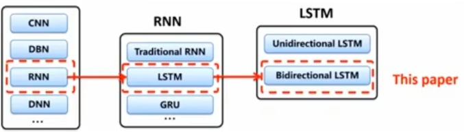

讨论数据集的问题

https://github.com/CGCL-codes/VulDeePecker

对于标记误报标记：用扫描器扫描历史版本，除了已发现问题的其他均为误报

### 第一步：生成代码片段

以API为point，向前进行程序切片，获取相关的代码片段，接着组装

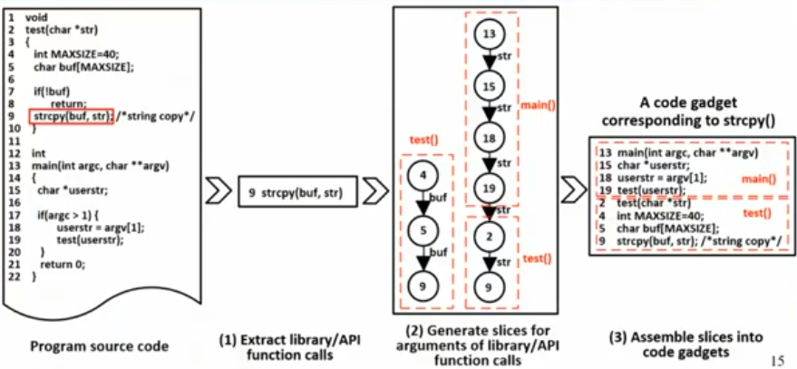

### 第二步：代码片段标记

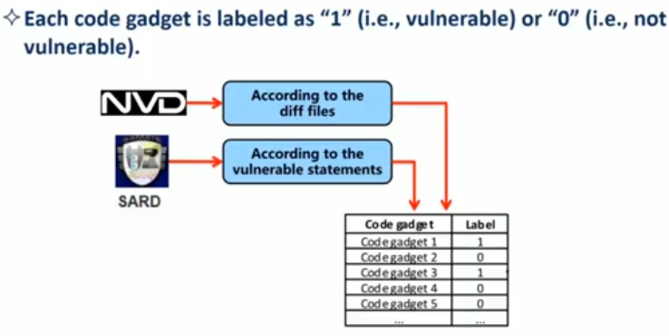

### 第三步：将代码片段转化为向量

将变量和用户函数替换为Token，接着将所有Token映射为向量

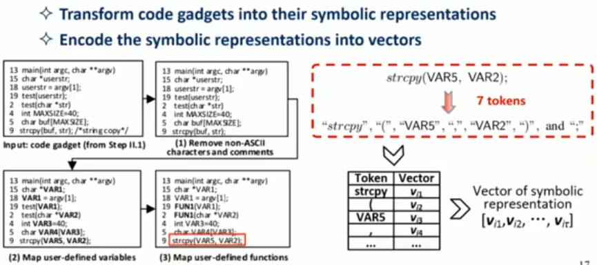

### 第四步：训练BLSTM神经网络

标准训练步骤，选用BLSTM考虑了上下文

### 第五步：检测

同样根据第一步到第三步将代码片段转化为向量

### 实验结果

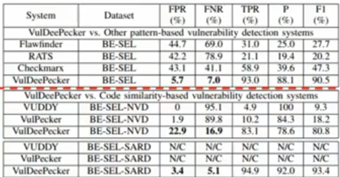

### 缺点

* 设计缺陷
  * 只能分析C/C++程序
  * 只能解决相关library/API方面的问题
  * 只能考虑data-flow不能考虑control-flow
* 实现缺陷
  * 受限于BLSTM
* 评估缺陷
  * 只评估了缓冲区溢出和资源管理问题  

# Toronto Deep Learning Series

## Automated Vulnerability Detection in Source Code Using Deep Learning

标记

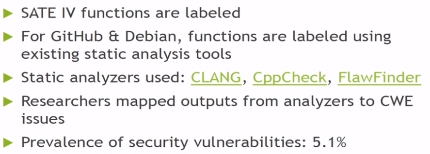

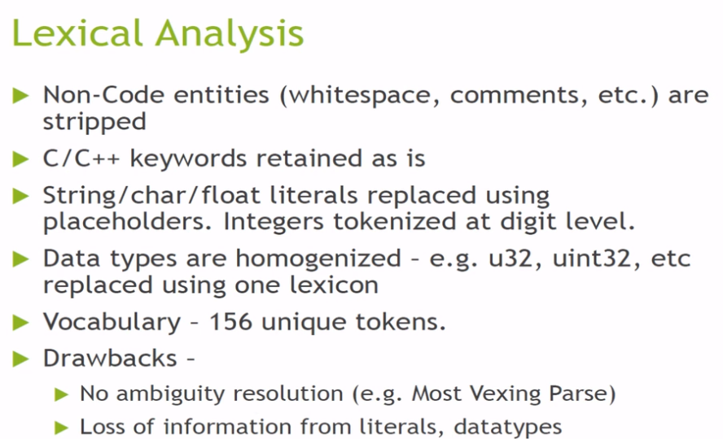

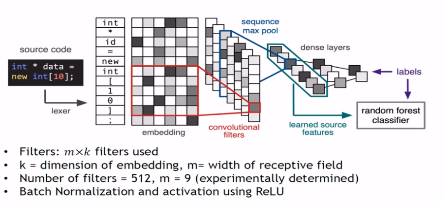

# ACSAC2016

## VulPecker: An Automated Vulnerability Detection System Based on Code Similarity Analysis

VulDeePecker的前驱工作，定义一组描述补丁的特性以及代码相似度算法检测源代码片段是否存在漏洞。

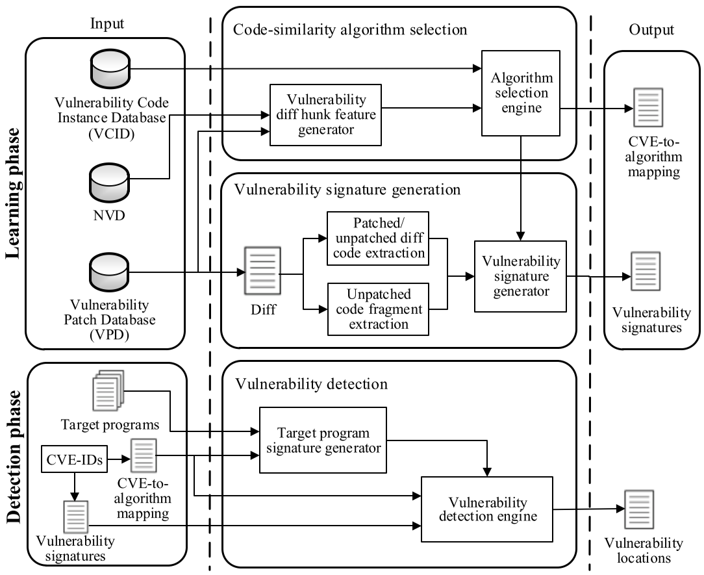

具体来说：

1. 本文建立了漏洞补丁数据集（VPD）和漏洞代码数据集（VCID）

2. 本文针对每一种漏洞构建了不同的代码相似度算法

### 关于对NVD提取的特征
2-6是对于Patch的描述。
* Type1：CVE-ID、CWE-ID、供应商、威胁等级等
* Type2：无实质性的特征，如：代码格式、空格变化、注释等
* Type3：组件特征，如：变量，常量、函数
* Type4：表达式特征，表达式的变化，如：赋值、if、for
* Type5：声明特征，声明的变化，如：增加，申出，移动
* Type6：函数特征：函数的变化，如：全局变量定义和宏
### 关于相似度选择

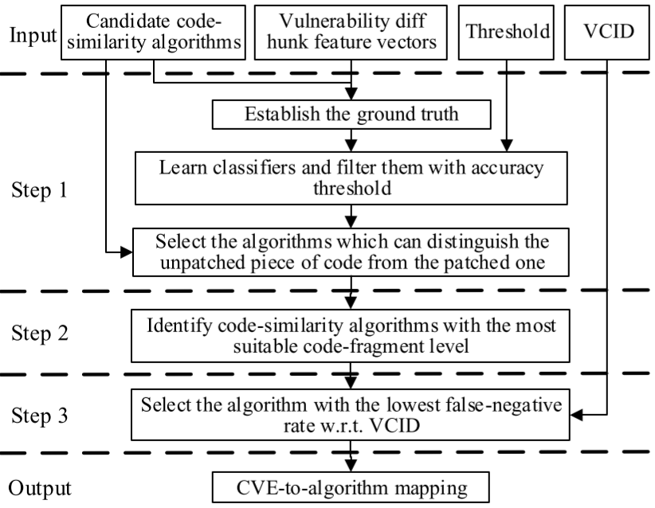

候选相似度算法

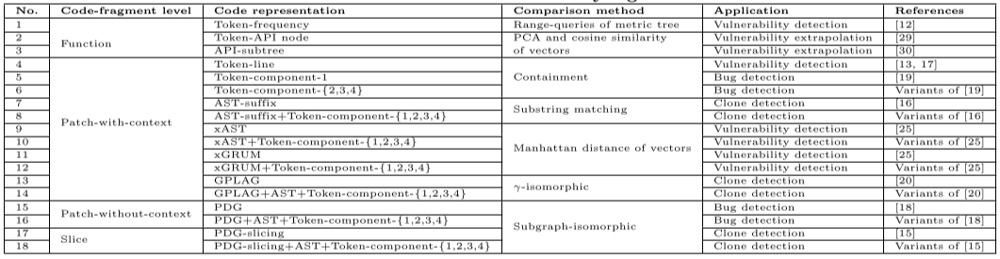

# MAPL2017

## Learning a Classifier for False Positive Error Reports Emitted by Static Code Analysis Tools

本文总结了误报模式，并且考虑用方法体/程序切片技术和机器学习降低误报率

<https://www.youtube.com/watch?v=hWiBU_Ht3lE>

### 误报模式

用户自己写的取消污点函数影响了污点传播

当污染字符和安全字符插入同一个Hashmap/ArrayList，而只使用安全字符拼接SQL时，污点传播受到欺骗

### 数据集

Owasp benchmark和Juliet

### 方法体/程序切片

方法体：直接将警告的方法字节码作为输入

切片：使用Tuning WALA进行程序切片（存在分析时间过长的问题）

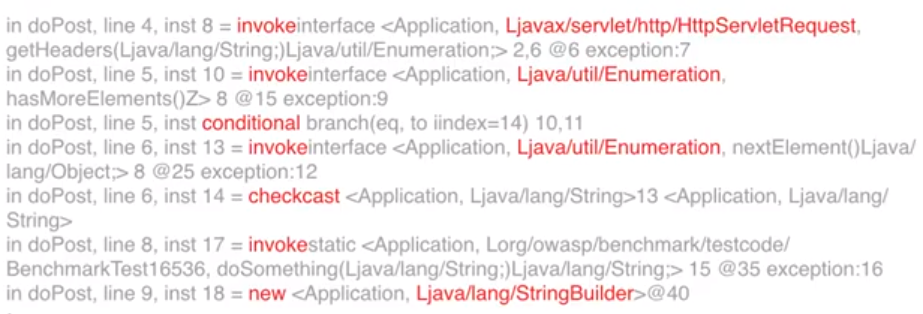

### 机器学习方法

朴素贝叶斯：对于朴素贝叶斯，我们只记录了操作码不记录操作数，但是调用的类会记录

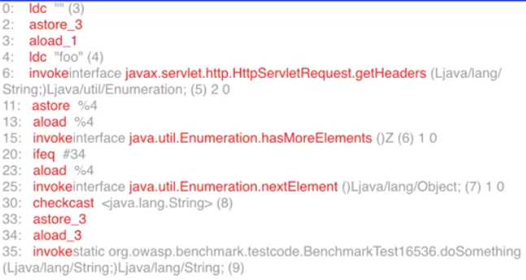

LSTM：对于LSTM，我们用空格分开每一个Token

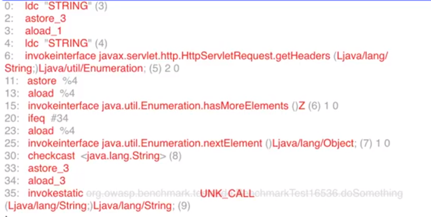

### 实验结果

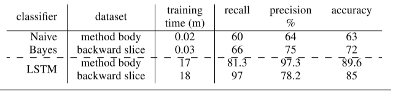

使用后向切片的分类器可以获得更少噪声，因此预测更准确。

### 未来工作

* 使用众包扩大数据
* 用RNN分析AST
* 扩展为半监督式的在线服务