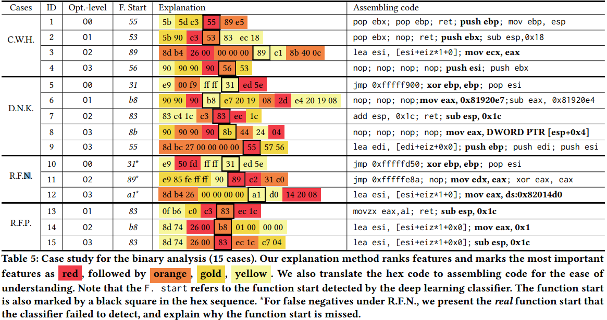
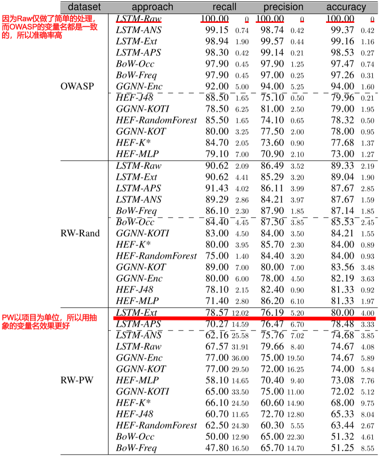
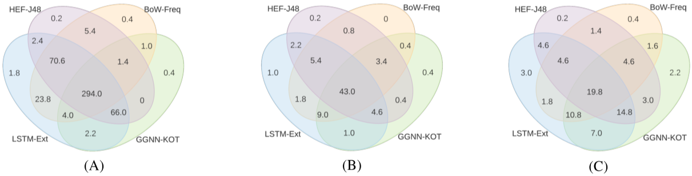
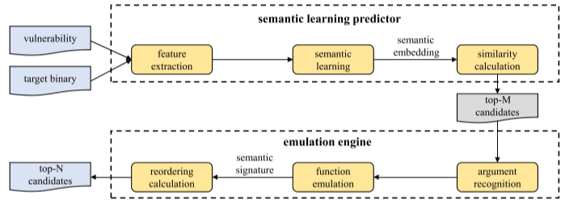

# CCS18

## **LEMNA: Explaining Deep Learning based Security Applications.**

通过突出特征来解释深度学习的结果：

# NDSS19

## One Engine To Serve 'em All: Inferring Taint Rules Without Architectural Semantics.
现有的污点传播方法需要手工判断污点是否传播，这对于不同的架构和指令集都需要手工判断，本文使用一些测试的输入输出来自动化推测污点是否传播。

## CodeAlchemist: Semantics-Aware Code Generation to Find Vulnerabilities in JavaScript Engines.

这篇论文解决了‘在fuzzing javascripty引擎时无法高效地生成“语义上有效的”测试用例’的问题

## Neural Machine Translation Inspired Binary Code Similarity Comparison beyond Function Pairs.

将汇编语言文本看做自然语言，从而使用NLP对汇编语言文本进行处理，由NLP自动挖掘汇编语言中的内在联系，最终达到相似度比较的目的

## Automating Patching of Vulnerable Open-Source Software Versions in Application Binaries.

自动化给程序打补丁

# NDSS2018

## VulDeePecker: A Deep Learning-Based System for Vulnerability Detection.

<https://www.youtube.com/watch?v=YcIzDi15zN0>

目前研究（手工规则）的缺点：

1. 需要手工定义特征
2. 存在FN（漏报）

讨论神经网络选择问题

讨论数据集的问题

https://github.com/CGCL-codes/VulDeePecker

对于标记误报标记：用扫描器扫描历史版本，除了已发现问题的其他均为误报

### 第一步：生成代码片段

以API为point，向前进行程序切片，获取相关的代码片段，接着组装

### 第二步：代码片段标记

### 第三步：将代码片段转化为向量

将变量和用户函数替换为Token，接着将所有Token映射为向量

### 第四步：训练BLSTM神经网络

标准训练步骤，选用BLSTM考虑了上下文

### 第五步：检测

同样根据第一步到第三步将代码片段转化为向量

### 实验结果

### 缺点

* 设计缺陷
  * 只能分析C/C++程序
  * 只能解决相关library/API方面的问题
  * 只能考虑data-flow不能考虑control-flow
* 实现缺陷
  * 受限于BLSTM
* 评估缺陷
  * 只评估了缓冲区溢出和资源管理问题  

# Toronto Deep Learning Series

## Automated Vulnerability Detection in Source Code Using Deep Learning

标记

# ACSAC17

## SecureDroid: Enhancing Security of Machine Learning-based Detection against Adversarial Android Malware Attacks.

基于机器学习检测Android恶意软件

# ACSAC2016

## VulPecker: An Automated Vulnerability Detection System Based on Code Similarity Analysis

VulDeePecker的前驱工作，定义一组描述补丁的特性以及代码相似度算法检测源代码片段是否存在漏洞。

具体来说：

1. 本文建立了漏洞补丁数据集（VPD）和漏洞代码数据集（VCID）

2. 本文针对每一种漏洞构建了不同的代码相似度算法

### 关于对NVD提取的特征
2-6是对于Patch的描述。
* Type1：CVE-ID、CWE-ID、供应商、威胁等级等
* Type2：无实质性的特征，如：代码格式、空格变化、注释等
* Type3：组件特征，如：变量，常量、函数
* Type4：表达式特征，表达式的变化，如：赋值、if、for
* Type5：声明特征，声明的变化，如：增加，申出，移动
* Type6：函数特征：函数的变化，如：全局变量定义和宏
### 关于相似度选择

候选相似度算法

# MAPL2017

## Learning a Classifier for False Positive Error Reports Emitted by Static Code Analysis Tools

本文总结了误报模式，并且考虑用方法体/程序切片技术和机器学习降低误报率

<https://www.youtube.com/watch?v=hWiBU_Ht3lE>

### 误报模式

用户自己写的取消污点函数影响了污点传播

当污染字符和安全字符插入同一个Hashmap/ArrayList，而只使用安全字符拼接SQL时，污点传播受到欺骗

### 数据集

Owasp benchmark和Juliet

### 方法体/程序切片

方法体：直接将警告的方法字节码作为输入

切片：使用Tuning WALA进行程序切片（存在分析时间过长的问题）

### 机器学习方法

朴素贝叶斯：对于朴素贝叶斯，我们只记录了操作码不记录操作数，但是调用的类会记录

LSTM：对于LSTM，我们用空格分开每一个Token

### 实验结果

使用后向切片的分类器可以获得更少噪声，因此预测更准确。

### 未来工作

* 使用众包扩大数据
* 用RNN分析AST
* 扩展为半监督式的在线服务

# ICST19

## An Empirical Assessment of Machine Learning Approaches for Triaging Reports of a Java Static Analysis Tool

本文展开实证研究，比较手工设计特征，词袋，RNN和GNN，使用真实程序集来测试他们的效果

### 测试集构建

本文挑选了部分程序手工打标签

benchmark和现实程序产生的误报原因存在不同：
1）工具发现不可能实现的流
2）工具不能发现污染源实际上被消除
3）污染源实际上没有被污染

### 方法选择

* Hand-engineered Features 手动写规则

* 程序切片，使用[Joana](https://github.com/joana-team/joana)程序切片工具，基于[WALA](http://wala.sourceforge.net/)

* Bag of Words，比较单词集合（不计顺序）的相似性，出现次数（BoW-Freq）、出现位置（BoW-Occ）

* RNN：

  * 数据清理：删除一些节点（不属于程序）

  * 抽象文字和字符串，例如两位数字用N2，三位数字用N3，更多位数字用N+,接着提取字符串列表并进行编号化，如STR1，STR2等

  * 许多程序员使用一组通用的短变量作为标识符如i,j,counter等，它对我们分析有意义，而其他变量名对程序分析无意义

    因此通过短语UNK标记一些无意义单词

  * 将camelCase和snake_case标识符拆分为组成单词  

* GNN

  * RNN不能表示程序的图结构，因此引入GNN

  * 我们使用了GNN的变体GGNN，引入三种初始化输入节点表示：

    1）种类、操作和类型字段（参照图一）
### 实验结果

#### RQ1总体结果

LSTM系的效果最好，紧接着是BoW和GGNN

#### RQ2数据预处理的作用

见红字，抽象化变量对新项目有效果

#### RQ4进一步分析

不同的算法的检测能力不重叠

###  威胁

* OWASP基准不能代表真实程序

* 我们扩充的14个程序的数据量不足以支持神经网络

### 未来工作

做一个投票机制，融合各个分析算法

# SIGSOFT FSE16

## VulSeeker-pro: enhanced semantic learning based binary vulnerability seeker with emulation.
本文首先使用语义学习预测器来快速预测目标二进制中与易受攻击函数最相似的前M个候选函数。然后将前M个候选函数输入到仿真引擎以求解，并且获得更准确的前N个候选函数

### 相似度比较
获取Top-200个相似的

1. 用IDA分析CFG，提取Genius提供的6个块和2个块为特征，编码为CFG为初始数字向量

2. 用Gemini的DNN网络训练

3. 用cos计算两个函数的相似度

### 模拟引擎
获取Top-25个候选函数
1. 

## PowerStation: automatically detecting and fixing inefficiencies of database-backed web applications in IDE.
自动化检测和修复Web应用问题

## SketchFix: a tool for automated program repair approach using lazy candidate generation.

# Others

# Idea

## 传统检测工具

* 工具发现不可能实现的流 （benchmark）
  * 当污染字符和安全字符插入同一个Hashmap/ArrayList，而只使用安全字符拼接SQL时，污点传播受到欺骗
* 工具不能发现污染源实际上被消除
  * 用户自己写的取消污点函数影响了污点传播
* 污染源实际上没有被污染

## 改进

可以考虑程序版本

针对漏洞类型做标记（猜想，不同漏洞可以由不同算法检测，如VulPecker和ICST19中的RQ4）

